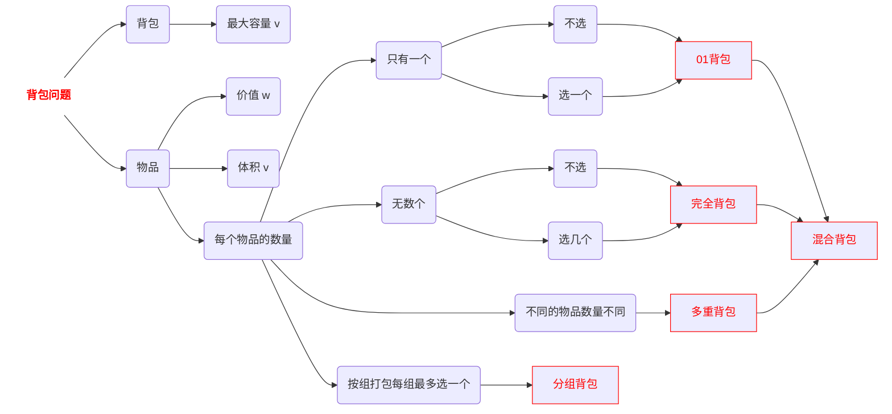

# C++算法笔记

---

[TOC]


## 基础语法与环境配置

#### 万能竞赛模板

- ```C++
  #include<bits/stdc++.h>			// 万能头文件
  using namespace std;
  
  using ll=long long;				// 简化long long 数据类型的声明
  const int MOD=998244353;		// 取模值(质数),也有1e9+7
  
  void solve(){}					// 实际解决方案
  
  int main(){
      
      ios::sync_with_stdio(false); // 加速外挂
      cin.tie(nullptr);			// endl换为 '\n'
      
      int T=1;
      cin>>T;						// 测试案例个数
      while(T--)solve();
      return 0;
  }
  ```

  


#### 输入输出技巧

- 浮点数控制: `cout<<fixed<<setprecision(n);`
- 整行读入: `getline(cin,str);`
- 自定义分隔符: `getline(cin,str,',')`

#### 常见存储思维转换:

- 题设与矩阵相关,各行输入的`元素间连续`(同一行内每个元素间无空格),则优先以`vector<string>v`存储[01回文](https://ac.nowcoder.com/acm/contest/120562/I)
- 需要打表存储固定数据时,可`压缩存储`为0/1矩阵,输出可考虑"`"YN"[条件]`来简化[A+B Problem](https://ac.nowcoder.com/acm/contest/120561/A)|[01矩阵](https://ac.nowcoder.com/acm/contest/120562/E)


#### 数据类型转换与判断

- 当操作数类型为long long时,直接使用的常数优先加LL后缀来声明类型,否则溢出.例: `long long t = 1<<big_num`会溢出,需要改为`ll t = 1LL<<big_num`
- 当操作数的范围接近*$10^9$*时,对其进行*和积运算*的结果用*长整型*来存储 

|       操作类型       |              方法               |
| :------------------: | :-----------------------------: |
|     char --> int     |       `int num = c -'0';`       |
|     int --> char     |      `char c = num +'0';`       |
| int,llong --> string | `string str = to_string(num);`  |
|    string --> int    |      `int num = stoi(str)`      |
| string --> long long | `long long num_ll = stoll(str)` |
|      大小写转换      |   `toupper(c)`, `tolower(c)`    |
|     数据类型判断     |   `isdigit(c)`, `isalpha(c)`    |


#### 数学函数

##### 常用内置函数

-  `max(a,b)`, `min(a,b)`. `abs()`. `sqrt()`.
- `hypot(dx, dy)`：直接计算 $\sqrt{dx^2 + dy^2}$，防止溢出。
- `gcd(a, b)` / `lcm(a, b)`：最大公约数与最小公倍数。

##### 模板函数

1. **is_prime** ( 素数 )

   ```C++
   vector<bool> Prime(n, true);
   void Prime(){
       // 素数筛选法
       for (int i = 2; i * i < MAX_N; i++) {s
           if (isPrime[i]) {
               for (int j = i * i; j < MAX_N; j += i) {
                   isPrime[j] = false;
               }
           }
       }
   }
   ```

 2.  **Factorial** ( 阶乘 )

     ```C++
     vector<long long> fact(MAX_N,1);// 太大的空间开不出来,数组大小需要控制
     void Factorial(){// 预处理操作,直接以数组形式调用
         for (int i = 1; i < MAX_N; i++){
             fact[i] = (fact[i - 1] * i) % MOD;
         }
     }
     ```
     
3. **GCD,LCM**  ( 辗转相除法 )     

   ```C++
   // 递归版
   long long gcd(long long a, long long b) {
       return b == 0 ? a : gcd(b, a % b);
   }
   // 非递归版：避免栈溢出（处理极大数字时）
   long long gcd_iter(long long a, long long b) {
       while (b) {
           a %= b;
           swap(a, b);
       }
       return a;
   }
   
   long long lcm(long long a, long long b) {
       if (a == 0 || b == 0) return 0;
       // 注意：先除后乘可以防止 a * b 直接相乘导致的溢出
       return (a / gcd(a, b)) * b;
   }
   ```

4. **($A^B) \% MOD$​** ( 快速幂 ) 

   ```C++
   // MOD一般在全局定义
   // 迭代写法
   long long qpow(int a, int b){
       long long res = 1;
       a%=MOD;	// 防止 a过大,直接对其取模
       while (b > 0){
           if (b & 1)res = res * a % MOD;	// 二进制最后一位为 1的情况
           a = a * a % MOD;	// 底数进行平方
           b >>= 1;	// 幂次减半
       }
       return res;
   }
   
   // 递归写法
   long long qpow(int a, int b){
       if (b == 1)return a;
       long long res = modpow(a, b >> 1);
       res = res * res % MOD;
       if (b & 1)return a * res % MOD;
       return res;
   }
   ```

  

#####  技巧结论

1. 分数计算 $H(n)=1+\frac{1}{2}+\frac{1}{3}+...+\frac{1}{n}$​

   ```C++
   sum += (1.0 / i);	// 用 1.0进行除法,强制转化为浮点运算
   ```

2. 约瑟夫环 (如:星期1~7循环).

   ```C++
   (index+Δstep)%n;			// 顺时针循环
   (index-Δstep%n+n)%n;		// 逆时针循环
   ```

3. 两点间距 $\sqrt {(x_1-x_2)^2+(y_1-y_2)^2}$​

   ```C++
   hypot(x1-x2,y1-y2);		// 返回两点间距
   ```

4. 取模运算

   ```C++
   (a+b)%MOD = a%MOD + b%MOD;	// 满足结合律
   (a*b)%MOD = a%MOD * b%MOD;
   
   (a-b)%MOD = (a%MOD - b%MOD + MOD)%MOD;	// 不允许有负数
   
   // 费马小定理: 求a在模p下的乘法逆元
   long long inv(long long a){	// MOD在全局定义
       return modpow(a,MOD-2);
   }
   ```


5. 三角形面积 

   - 根据**几何坐标**: $Area=\frac{1}{2}|x_1(y_2-y_3)+x_2(y_3-y_1)+x_3(y_1-y_2)|$

   - 根据**边长长度**: $Area=\sqrt{s(s-a)(s-b)(s-c)}, s=\frac{a+b+c}{2}$

   

#### 位运算

- 运算符号

| 数学符号表示 | 运算符 | 运算性质                          |
| :----------: | :----: | --------------------------------- |
|     AND      |   &    | 只有两个对应位都为 1 时才为 1     |
|      OR      |   \|   | 只要两个对应位中有一个 1 时就为 1 |
|     NOT      |   ~    | 0 变为 1, 1 变为 0                |
|    XOR,⊕     |   ^    | 只有两个对应位不同时才为 1        |
|              |        |                                   |


- 运算结论

|  序号   | 公式表达                     | 结论说明                               |
| :-----: | ---------------------------- | :------------------------------------- |
|    1    | a+b = ab --> a&b=0           | 推导                                   |
|    2    | a^b to min                   | 二进制为 1 的位数尽可能靠左,尽可能相同 |
|    3    | n & (n-1)                    | 判断 n 是否为 2 的整数幂次             |
|    4    | num & 1                      | 判断 num的最低位是否为1 (奇数)         |
|    5    | 0^a = a                      | 0与a的异或和为 a                       |
|    6    | a\^a\^a\^a\^...\^a\^a\^a = 0 | 任意个相同数的异或和为 0               |
| 7 (5&6) | a\^a\^a\^a\^...\^a\^a\^B = B | 找出一堆相同数中不同的数               |
|    8    | a<<=b                        | 把a的二进制序列向左位移b位,即$a*2^b$   |
|    9    | x \| y==y                    | 说明二进制序列中,x为1的位置y都为1      |
|   10    | a >> b & 1                   | 获取 a 的第 b 位编号                   |
|   11    | a & ~(1 << b)                | 将 a 的第 b 位设置为 0                 |
|   12    | a \| (1 << b)                | 将 a 的第 b 位设置为 1                 |
|   13    | a ^ (1 << b)                 | 将 a 的第 b 位取反                     |
|   14    | a & (1 << b)                 | 获取 a 的第 b 位编号                   |
|   15    | bool f = ((x ^ y) < 0);      | 判断 x, y 是否异号                     |
|         |                              |                                        |
|         |                              |                                        |

#### 名词解释 ( 不完全中肯 )

1. <u>乘法逆元</u> : 根据费马小定理，在模数 m 为质数，且 b 不是 m的倍数的情况下有：$\frac{a}{b}\mathrm{~mod~}MOD=a\times(b^{MOD-2})\mathrm{~mod~}MOD$​
2. <u>长度为 n 的排列</u>：由 $1,2,…,n$​ 这 n 个整数、按任意顺序组成的数组（每个整数均恰好出现一次）。例如，{2,3,1,5,4}是一个长度为 5 的排列，而 {1,2,2}和 {1,3,4}都不是排列，因为前者存在重复元素，后者包含了超出范围的数。
3. <u>MEX</u>: MEX 定义为没有出现在集合中的最小非负整数。例如，$MEX⁡(1,2,3)=0、MEX(0,2,5)=1$。
4. <u>数组的字典序比较</u>: 从左到右逐个比较两个数组的元素。如果在某个位置上元素不同，比较这两个元素的大小，元素小的数组字典序也小。如果一直比较到其中一个数组结束，则长度较短的数组字典序更小。例如, {2,3,4,5} 的字典序小于 {2,4,3,5},也小于 {3,2,4,5}
5. <u>连通块</u>: 在网格中，若两个坐标间的曼哈顿距离为 1 则视为相邻。由数值相等的格子按该相邻关系划分的极大连通子集称为一个连通块。
6. <u>子序列</u>: 从原序列中删除任意个（可以为零，也可以为全部）元素，且保持剩余元素相对顺序不变得到的新序列。例: {1,2,3,4,5}的子序列之一可以是 {2,5}

---

#### 进阶语法

- ####  Lambda 表达式 `auto 函数名 = [捕获列表](参数列表) -> 返回类型 { 函数体 };`

  - `[ 捕获列表 ]`中,填`&`可以引用捕获外边的变量,同时避免容器的拷贝
  - `( 参数列表 )`中,一般为`(const vector<T>& 容器名)`避免大量拷贝导致TLE

  ```C++
  // 场景1: 自定义排序规则
  sort(v.begin(),v.end(),[](int a,int b){
      return a > b;// 降序排列
  })
  
  // 场景2: 可高效处理的内部函数, 多次执行同一逻辑
  auto func = [&](const vector<long long>& vec, ...) {
      long long ans = 0;
     ...
      return ans;
  };
  
  // 场景3: 优先队列自定义规则,关键字decltype
  priority_queue<int, vector<int>, decltype(cmp)> pq(cmp);
  ```

  

## STL容器

#### **迭代器**

- ```C++
  auto itA=v.begin(); // 指向容器第一个元素,*it表示实际存储的值
  auto itB=v.end(); //指向最后一个元素的下一个位置,*it报错
  for(auto it=v.begin();it!=v.end();it++);// 遍历
  
  auto itA=v.rbegin(); // 指向容器最后一个元素
  auto itB=v.rend(); //指向第一个元素的前一个位置
  for(auto it=v.rbegin();it!=v.rend();it++);// 逆序遍历
  
  min_element(v.begin(),v.end());	// 返回指向最小值的迭代器
  max_element(v.begin(),v.end());	// *max_element得到具体值
  ```

####  algorithm

- **sort** ( 排序 )

  ```C++
  sort(v.begin(),v.end()); // 升序排序
  sort(v.begin(),v.end(),greater<T>);	// 降序排序
  
  sort(v.begin(), v.end(), [](int a, int b) {
          return a > b;
      });	// 自定义排序
  ```

  

- **merge** ( 合并 )

  ```C++
  //merge(iterator beg1, iterator end1, iterator beg2, iterator end2, iterator dest);
  merge(v1.begin(), v1.end(), v2.begin(), v2.end(), vtarget.begin());	// 合并两个序列
  
  ```

- **accumulate** ( 累加和 )

  ```C++
  //accumulate(iterator beg, iterator end, value);
  int total = accumulate(v.begin(), v.end(), 0);// 计算容器元素累计总和
  
  ```

- **fill** ( 填充 )

  ```C++
  //fill(iterator beg, iterator end, value);
  fill(v.begin(), v.end(), val);//容器区间内元素填充为指定的值
  ```

- **count** ( 计数 )

  ```C++
  // count(iterator beg, iterator end, value), 返回值为整数
  int numX=count(v.begin(),v.end(),x);// 统计容器区间内值为 x的个数
  ```

  

#### **string**

##### 增删改查

- ```C++
  strA+=strB;		// 尾部拼接
  str.insert(index,"A");	//指定索引index位置插入字符"A"
  
  auto pos=str.find("abc");	// 查找str是否包含子串,pos为size_t类型,直接输出则为索引
  if(pos!=string::npos){}	// 表示查找成功的情况
  ```

##### **reverse** ( 反转字符串 )

- ```C++
  reverse(str.begin(),str.end()); // 无返回值
  ```

##### **replace** ( 替换字符 )

- ```C++
  replace(str.begin(),str.end(),'A','B');	// 将所有'A'替换为'B', 无返回值
  ```

##### **transform** ( 转换大小写 )

- ```C++
  transform(s.begin(), s.end(), s.begin(), ::tolower);// 全部转为小写字符
  transform(s.begin(), s.end(), s.begin(), ::tolower);// 全部转为大写字符
  ```

##### **substr** ( 分割子串 )

- ```C++
  // substr(起始索引, 字符个数)
  string t=str.substr(0,2); // 从索引0位置开始分割str的两个字符
  ```

##### **remove+erase** ( 去除所有空格 )

- ```C++
  str.erase(remove(str.begin(),str.end(),' '),str.end());
  
  auto new_end=remove(str.begin(), str.end(), ' ');	// 将所有非空格字符覆盖到容器前面，保持相对顺序,返回的迭代器指向新范围的末尾（第一个被"移除"的空格的位置）
  str.erase(new_end, str.end());	// 从 new_end 到容器末尾的所有元素进行真正的删除
  ```


#### **vector** ( 动态数组 )

##### 一维动态数组声明

- ```C++
  vector<T>v;	// 只声明, 不开辟空间, 后续用v.push_back()插入
  vector<T>v(n);	// 开辟大小为n的空间并初始化为0,可直接用v[i] 
  vector<T>v(str.begin(),str.end());	// 用字符串进行拷贝构造
  ```

##### 增删

- ```C++
  v.push_back(ele);	// 在数组末尾增添元素ele
  v.pop_back();	// 删除最后一个元素
  
  v.insert(iterator,ele);	// 在迭代器it位置插入元素ele
  v.erase(iterator);	//删除迭代器it位置的元素
  v.erase(iteratorA,iteratorB);	// 删除迭代器itA~itB之间的元素
  ```

##### 查找

- ```C++
  v.empty();	// 判断是否为空
  v.size();	// 返回元素个数
  
  v.begin();	// 返回首元素的值
  v.back();	// 返回尾元素的值
  ```


#### stack (栈)

- ```C++
  stack<T> stk;	// 声明容器
  
  stk.push(val);	// 向栈顶添加元素val
  stk.pop();	// 从栈顶移除第一个元素
  stk.top();	// 返回栈顶元素
  
  stk.empty();	// 判断栈是否为空
  stk.size();		// 返回栈的大小
  ```

- 习题集

  - [验证栈序列](https://www.nowcoder.com/practice/d3178fe362dd4810b577c77c9e128fc5?tpId=383&tqId=11211496&sourceUrl=)

#### queue (队列)

- ```C++
  queue<T> que;	// 声明容器
  
  que.push(val);	// 往队尾添加元素val
  que.pop();	// 从队头移除第一个元素
  que.front();	// 返回队首元素
  que.back();		// 返回队尾元素
  
  que.empty();	// 判断队列是否为空
  que.size();		// 返回队列的大小
  ```

- 

#### list (双向链表)

- ##### 适用条件: 保留插入顺序,支持拼接

- ```C++
  list<T> lt;
  
  lt.push_front(val);	// 在容器开头插入一个元素
  lt.push_back(val);	// 在容器尾部加入一个元素
  
  lt.pop_front();	// 从容器开头移除第一个元素
  lt.pop_back();	// 删除容器中最后一个元素
  
  lt.insert(pos,lt.begin(),ls.end());//在pos位置插入[beg,end)区间的数据，无返回值。
  lt.erase(lt.begin(),lt.end());//删除[beg,end)区间的数据，返回下一个数据的位置。
  lt.erase(it);//删除迭代器it所指位置的值，返回下一个数据的位置。
  lt.remove(val);//删除容器中所有与val值匹配的元素。
  
  lt.front();	// 返回首元素的值
  lt.back();	// 返回尾元素
  ```

- ##### 反转和排序

- ```C++
  lt.sort(); // 默认的排序规则从小到大
  lt.sort(greater<T>()); // 降序
  lt.sort(cmp);	// 自定义
  
  lt.reverse();
  ```


#### priority_queue (优先队列)

- 声明

  ```C++
  priority_queue<T>pq;	// 最大值先出队
  priority_queue<T, vector<T>, greater<T> > pq; // 最小值先出队
  priority_queue<int, vector<int>, decltype(cmp)> pq(cmp);	// 自定义
  
  auto cmp = [](int a, int b) { return 表达式(例:a > b); };
  ```

- 两端优先队列考虑使用 multiset

#### set (集合)

##### **set** ( 所有元素在插入时自动被排序 )

- 键值对声明

- ```C++
  set<T>st;	// 默认构造声明
  set<T,greater<T1> >st;	// 元素降序排序
  set<T,decltype(cmp)> st(cmp);	// 自定义排序规则
  
  auto cmp=[](T1 a,T2 b){retrun 表达式(例: a>b );} // 自定义
  ```

- 基本操作

- ```C++
  st.size();	// 返回元素个数(去重后)
  st.empty();	// 判断是否为空,返回值bool
  
  st.insert(ele);	// 插入元素ele
  st.insert(ele).second // 返回bool值,插入成功为true, 已有元素ele则返回false
  st.erase(ele);	// 删除元素ele
  st.erase(it);	// 删除迭代器it所在指向位置的值
  
  st.count(ele);	// 返回值为ele的个数
  st,find(ele);	// 查找元素ele是否存在,存在则返回it,否则返回st.end()
  ```

  

##### **multiset** ( 允许容器中有重复的元素 )

- ```C++
  mset.erase(val); // 删掉所有为val的值
  
  mset.erase(mset.rbegin());	// 删掉最大值(默认)
  ms.erase(prev(ms.end()));	// 同理
  ms.erase(--ms.end());		// 同上
  
  mset.erase(mset.begin());	// 删掉最小值(默认)
  
  
  int getPre(int x){	//TODO 实现找前驱
      auto it = mset.lower_bound(x);// 找到大于等于x的元素的最大值
      if(it == mset.begin()) return -1;	
      else return *prev(it);// 找到第一个比x小的数,prev()返回it的前一个迭代器,也可以用*(--it)
  }
  
  int getBack(int x){	//TODO 实现找后继
      auto it = mset.upper_bound(x);// 找到第一个比x大的元素
      if(it == M.end()) return -1;
      else return *it;
  }
  ```


##### **unordered_set** ( 仅用来去重 )

#### map (键值对)

##### **map** ( 用于key需要排序的情况 )

- 键值对声明

- ```C++
  map<T1,T2>mp;	// 一般声明,keys升序排序
  map<T1,T2,greater<T1> >mp;	// keys降序排序
  map<T1,T2,decltype(cmp)> mp(cmp);	// 自定义排序规则
  
  auto cmp=[](T1 a,T2 b){retrun 表达式(例: a>b );} // 自定义
  ```

- 基本操作

- ```C++
  mp.size();	//返回keys元素的数目
  mp.empty();	//判断是否为空,返回值bool
  
  mp[key]=value;	// 插入键值对{key:val}
  mp.erase(key);	// 删除map中键为key的键值对
  
  mp.count(key);	// 统计key元素的个数
  mp.find(key);	// 查找key是否存在,存在则返回it,否则返回mp.end()
  
  for(auto it = mp.begin();it != mp.end();it++){
  if(mp.find(key)==mp.end()){}	// 未查找到元素的情况
  cout << "key:"<<it->first;		// 访问用it->first为键key,it->second为值val
  cout <<"value:"<< it->second;
  }
  
  ```

  

##### **multimap** ( 用于键key可重复的情况 )

##### **unordered_map** ( 不需要排序, 性能最好, 最常用 )

---


## 基础算法

#### 二分法

利用数据的**有序性**，每轮缩小一半搜索范围，直至找到目标元素或搜索区间为空为止

- 二分查找**目标元素**target索引

- ```C++
  /* 二分查找目标元素（左闭右开区间） */
  int binarySearchLCRO(vector<int> &nums, int target) {// nums必须有序
      // 初始化左闭右开区间 [0, n) ，即 i, j 分别指向数组首元素、尾元素+1
      int i = 0, j = nums.size();
      // 循环，当搜索区间为空时跳出（当 i = j 时为空）
      while (i < j) {
          int m = i + (j - i) / 2; // 计算中点索引 m, 防止溢出
          if (nums[m] < target)    // 此情况说明 target 在区间 [m+1, j) 中
              i = m + 1;
          else if (nums[m] > target) // 此情况说明 target 在区间 [i, m) 中
              j = m;
          else // 找到目标元素，返回其索引
              return m;
      }
      // 未找到目标元素，返回 -1
      return -1;
  }
  ```

- 二分查找**插入点** ( 存在重复元素 )

- ```C++
  /* 二分查找插入点（左闭右开区间） */
  int binarySearchInsertion(vector<int> &nums, int target) {
      int i = 0, j = nums.size(); // 初始化左闭右开区间 [0, n)
      while (i < j) {             // 当 i == j 时，区间为空，循环结束
          int m = i + (j - i) / 2; // 计算中点索引 m
          if (nums[m] < target) {
              i = m + 1;           // target 在区间 [m+1, j) 中
          } else if (nums[m] > target) {
              j = m;              // target 在区间 [i, m) 中, 可与else直接合并
          } else {
              j = m;    // 关键点：为了找到最左侧插入点，即便相等也收缩右边界
          }
      }
      // 返回插入点 i (此时 i == j)
      return i;
  }
  ```

- 哈希查找, 利用键值对 { 元素,索引 }来记录位置,本质是借助计数排序的思想

- ```C++
  // 预处理：空间 O(n)，时间 O(n)
  unordered_map<int, int> setupHash(vector<int> &nums) {
      unordered_map<int, int> dic;
      // 倒序遍历，确保记录的是相同元素的第一个（最左侧）索引
      for (int i = nums.size() - 1; i >= 0; i--) {
          dic[nums[i]] = i;
      }
      return dic;
  }
  
  // 查找：时间 O(1)
  int findTarget(unordered_map<int, int> &dic, int target) {
      if (dic.find(target) != dic.end()) {
          return dic[target];
      }
      return -1; // 如果不存在，哈希表无法直接给出“插入点”
  }
  ```

#### 前缀和/差分

- 一维前缀和

  - 通过 O(n）时间预处理，能够将单次复杂度降低到 O(1）

  - 对于数组 $a_n$ ,序列的前缀和为$S_i=\sum_{j=1}^{i}a_j $ ,递推关系式为$S_0=0,S_i=S_{i-1}+a_i$​

  - 想要询问区间 [l,r]内的序列和,只需要计算差值$S([l,r])=S_r-S_{l-1}$​

- ```C++
  int n;                // 数组大小.
  std::vector<int> a;   // 数组. (下标从 1 开始)
  std::vector<int> prefix;  // 前缀和数组.
  
  // 计算前缀和
  void prefix_sum() {
    prefix = a;
    for (int i = 1; i <= n; ++i) {
      prefix[i] += prefix[i - 1];
    }
    // Or 简化:
    // std::partial_sum(a.begin(), a.end(), ps.begin());
  }
  
  // 查询 [l, r] 区间内的元素的和
  int query(int l, int r) { return prefix[r] - prefix[l - 1]; }
  ```

- 二维前缀和

  - 给定大小为 $m\times n $的二维数组 A,求出其前缀和 S,则S的大小同样为 $m\times n $ 且$S_{i,j}=\sum_{i^{\prime}\leq i}\sum_{j^{\prime}\leq j}A_{i^{\prime},j^{\prime}}.$​
  - 基于容斥原理,得到递推关系  $S_{i,j}=A_{i,j}+S_{i-1,j}+S_{i,j-1}-S_{i-1,j-1}.$​
  - 要想查询子矩阵的和,则计算  $S_{i_2,j_2}-S_{i_1-1,j_2}-S_{i_2,j_1-1}+S_{i_1-1,j_1-1}$,时间复杂度降到O(mn)​

- ```C++
  int n, m;
  std::vector<std::vector<int>> a, ps;  // (n + 1) x (m + 1).
  
  // 计算二维数组的前缀和
  void prefix_sum() {
    ps = a;
    for (int i = 1; i <= n; ++i)
      for (int j = 1; j <= m; ++j)
        ps[i][j] += ps[i - 1][j] + ps[i][j - 1] - ps[i - 1][j - 1];
  }
  
  // 查找在 [x1, y1] 到 [x2, y2] 的子矩阵的元素和
  int query(int x1, int y1, int x2, int y2) {
    return ps[x2][y2] - ps[x1 - 1][y2] - ps[x2][y1 - 1] + ps[x1 - 1][y1 - 1];
  }
  ```

- 一维差分

  - 前缀和的逆运算, 一般是通过维护差分序列信息, 对区间多次修改后恢复原序列, 实现对原序列的查询
  - 对于数组 $a_n$, 差分序列为 $D_i=a_i-a_{i-1}, a_0=0$, 差分序列的前缀和即为原数组
  - 区间操作,在区间 [l,r]中的每个数都加上一个值v, 则 $D_l=D_l+v, D_{r+1}=D_{r+1}-v$​

- ```C++
  int n;
  std::vector<int> diff, a;
  
  // 为区间 [l, r]内所有元素加值 v
  void add(int l, int r, int v) {
    diff[l] += v;
    if (r < n) diff[r + 1] -= v;
  }
  
  // 在所有修改之后,查询之前执行前缀和操作恢复原序列
  void prefix_sum() {
    for (int i = 1; i <= n; ++i) a[i] = a[i - 1] + diff[i];
  }
  ```

- 二维差分

  - 多维差分可看作多维前缀和的逆运算,则求多维差分数组的操作就相当于根据多维前缀和求它的原数组,即  $D_{i,j}=a_{i,j}-a_{i-1,j}-a_{i,j-1}+a_{i-1,j-1}.$​

  - 要对左上角$(x_1,y_1)$,右下角$(x_2,y_2)$的矩阵中每个数字加上v,可以对其差分数组进行操作

    ​			$$\begin{gathered}
    D_{x_1,y_1}\leftarrow D_{x_1,y_1}+v, \\
    D_{x_1,y_2+1}\leftarrow D_{x_1,y_2+1}-v, \\
    D_{x_2+1,y_1}\leftarrow D_{x_2+1,y_1}-v, \\
    D_{x_2+1,y_2+1}\leftarrow D_{x_2+1,y_2+1}+v.
    \end{gathered}$$​

  - 在所有修改操作结束后，只需要执行一遍二维前缀和，就可以快速查询更新后的数组的值

  ```C++
  int n, m;
  std::vector<std::vector<int>> diff, a;
  
  // 为 [x1, y1] 到 [x2, y2]的每一个元素都加v
  void add(int x1, int y1, int x2, int y2, int v) {
    diff[x1][y1] += v;
    if (x2 < n) diff[x2 + 1][y1] -= v;
    if (y2 < m) diff[x1][y2 + 1] -= v;
    if (x2 < n && y2 < m) diff[x2 + 1][y2 + 1] += v;
  }
  
  // 在所有修改之后,查询之前执行前缀和操作恢复原序列.
  void prefix_sum() {
    a = diff;
  
    for (int i = 1; i <= n; ++i)
      for (int j = 1; j <= m; ++j) a[i][j] += a[i - 1][j];
  
    for (int i = 1; i <= n; ++i)
      for (int j = 1; j <= m; ++j) a[i][j] += a[i][j - 1];
  }
  ```

  

#### 模拟/枚举/倍增

严格遵循题目规则，不重不漏地 (or 有智慧地)穷举所有可能状态

1. **建表查询**: 将**状态抽象化**, 对于日期(仅12个固定值), 方位(上,下,左,右)等可枚举的量,直接建表

   ```C++
   // 数组查表处理月份天数
   int days[] = {0, 31, 28, 31, 30, 31, 30, 31, 31, 30, 31, 30, 31};
   // 数字确定移动方向
   int dir[4][2] = {{0, 1}, {1, 0}, {0, -1}, {-1, 0}};
   for(int k=0;k<4;k++){
       int xx=x+dir[k][0],yy=y+dir[k][1];
       if(边界合法性判断)continue;// 新坐标不合法
       ...	// 执行解决办法
   }
   ```

2. **面向过程,结果编程**: 保证所有过程都在问题之内,排演所有结果符合测试集要求

3. 关于枚举: 考虑可能的情况, 枚举的元素, 枚举的空间范围(有优化空间), 枚举顺序

    


#### 贪心

鼠目寸光: 不从整体最优上加以考虑，而是始终做出**在当前看来最好的选择**,刷题!刷题!再刷题!

- 注意点:

  1. 可以一直向前走, 没有后顾之忧. ( 贪心思想的选择, 局部最优走到终点即为全局最优 )
  2. 关键问题转化, 边界条件的处理. ( 找到贪心策略 )
  3. 每轮都将问题转化成一个规模更小的子问题，直到问题被解决. 
  4. 一般配合排序等方法找最值

  

- 典型例题思维:

  - 双向约束(邻域依赖)问题: 将双向约束拆分为两个单向约束, 分别进行遍历。**先解决左邻居，再解决右邻居, 最后取极值**。

    > [分发糖果](https://leetcode.cn/problems/candy/)
    >
    > [接雨水](https://leetcode.cn/problems/trapping-rain-water/)(贪心,双指针,动态规划,单调栈)

  - 容器选择,性能优化: vector(动态数组)的增删操作相对于list(双向链表)的耗费要大得多,依据已有思路可以转变容器优化性能

    > [根据身高重建队列](https://leetcode.cn/problems/queue-reconstruction-by-height/)

  - 区间排序方向选择: **不重叠调度**选右端点；**合并区间**选左端点。

    - 选右边界排序,可避免区间范围过大的问题

    > [用最少数量的箭引爆气球](https://leetcode.cn/problems/minimum-number-of-arrows-to-burst-balloons/)(合并区间)
    >
    > [无重叠区间](https://leetcode.cn/problems/non-overlapping-intervals/)(左右均可,推荐右)

  - 遍历顺序的选择: 不要有后顾之忧,宁愿边界多处理,也不回头看一步

    > [单调递增的数字](https://leetcode.cn/problems/monotone-increasing-digits/)
    >
    > [划分字母区间](https://leetcode.cn/problems/partition-labels/)

---


## 搜索

#### backtrack ( 回溯 )

核心思想是从一个初始状态出发，<u>暴力搜索</u>所有可能的解决方案，当遇到正确的解则将其记录，直到找到解或者尝试了所有可能的选择都无法找到解为止. 本质上是穷举, 效率并不高, 一般为指数级别, 可借助剪枝优化来提高效率.

- 一般解决以下问题: 

  ```php
  1. 组合问题：N个数里面按一定规则找出k个数的集合, 不强调元素顺序
  2. 切割问题：一个字符串按一定规则有几种切割方式
  3. 子集问题：一个N个数的集合里有多少符合条件的子集
  4. 排列问题：N个数按一定规则全排列，有几种排列方式, 强调元素顺序
  5. 棋盘问题：N皇后，解数独等等
  ```

- 一般模板[ **回溯函数**, **终止条件**,**遍历过程**,( 剪枝 ) ]

  ```cpp
  // 参数列表 vector<vector<T> >&res, vector<T>&path, int startIndex, vector<T>nums
  void backtrack(参数) {   
      // 求子集等情况,可在该行存放结果
      if (终止条件) {
          存放结果;
          return;
      }
  
      for (选择：本层集合中元素（树中节点孩子的数量就是集合的大小）) {
    //for(int i=startIndex; i<nums.size()&& (剪枝操作) ; i++ )
          if(...){continue;}// 也可以剪枝
          处理节点;
          // path.push_back(nums[i]);
          backtrack(路径，选择列表); // 递归
          // backtrack(res, path, i+1, nums);
          回溯，撤销处理结果;
          // path.pop_back();
      }
  }
  
  // 调用
  vector<vector<T>> res;
  vector<T>path;
  backtrack(res,path , 0, nums);
  ```

  - 关于startIndex
    - `i==startIndex`是为了避免单纯因为顺序不同而重复出现的子答案
    - 在回溯过程中`for(i=start；xxxx; i++){}`,i++是为了确保子答案的选取时不会再从头开始选取
    - 如果是排列，不同顺序代表了不同的答案，则`int i=0`. startlndex不再需要
    - 去重操作,` if (i > start && num[i] == num[i-1]) continue;`
  - 关于sum Target
    - 题目要求子项和等于target，因此首先要注意除了正常return，还要考虑`sum>target`立刻return
    - 剪枝操作，`sum+子项<=target`，但是要注意子项必须满足升序排列，有必要时提前sort()
  - 关于优化
    - 组合类问题, 如果仅用于求符合解的个数, 可以使用dp优化[例: 目标和](https://leetcode.cn/problems/target-sum/)

#### DFS ( 深度优先搜索)


#### BFS ( 广度优先搜读 )

---


## DP (动态规划)

将一个问题**分解**为一系列更小的子问题，并通过**存储子问题的解**来避免重复计算, 旧状态+决策=新状态

- 一般解题步骤: 
  1. 确定dp数组（一维或二维）以及下标的含义
  2. 借助数学归纳思想, 确定递推公式 ( 状态转移方程 )
  3. dp数组如何初始化
  4. 确定遍历顺序
  5. 举例推导 ( 或打印 ) dp数组 ( debug ) 

- 一般模板

  以leetcode 96.[不同的二叉搜索树](https://leetcode.cn/problems/unique-binary-search-trees/)为例

  ```C++
  int numTrees(int n) {
      vector<int> dp(n + 1);	// 明确下标含义, 声明dp数组, 大小为n-1
      dp[0]= 1;// 依据题意初始化基础值
      for (int i = 1; i <= n; i++) {	// 确定遍历规则和顺序
          for (int j = 1; j <= i; j++) { 
              dp[i] += dp[j - 1] * dp[i - j];// 递推公式, 依赖于子问题的解
          }
      }
      return dp[n];
  }
  ```

#### **背包问题**

- 



- 解题步骤( 二维DP数组 ) :

  1. 声明数组`dp[i][j]`: ` i`表示**第i个物品**, `j`表示**容量为 j的背包**,`dp[i][j]`表示从下标为[ 0~i ]的物品里任意取，放进容量为 j的背包，`价值总和最大是多少`
  2. 状态转移分析: 
     1. 不放物品 i: 最大价值延续,即`dp[i][j] = dp[i-1][j]`
     2. 放物品 i: 背包空出物品i的容量,转为`j-weight[i]`后,放物品`+value[i]`,即`dp[i][j] = dp[i-1][ j-weight[i] ]+ value[i]`
     3. 得出递推公式 `dp[i][j] = max(dp[i - 1][j], dp[i - 1][j - weight[i]] + value[i]);`

  3. 初始化dp数组: 每一个( i,j )都需要依赖左上方和正上方的解,则`用第1个物品初始化第一行`,从第2个物品开始分析; 背包容量为0时不放物品,则`第一列初始化为0`; 非零下标无需初始化,任意值均可

  4. 遍历顺序( 物品先?背包先? ): 对于01背包的二维DP均可

  5. 打印DP数组( debug ): 

     | 物品(索引 i )\背包容量c  | 0    |      1       |      2       |      3       |      4       |
     | :----------------------: | ---- | :----------: | :----------: | :----------: | :----------: |
     | 物品( `0` ), 价值$val_1$ | 0    | 当前最大价值 | 当前最大价值 | 当前最大价值 | 当前最大价值 |
     | 物品( `1` ), 价值$val_2$ | 0    |              |              |              |              |
     | 物品( `2` ), 价值$val_3$ | 0    |              |              |              |   `最终解`   |

  6. 空间优化( 二维DP -> 一维滚动数组 ):
     - `dp[j]`表示容量为 j的背包，所背的物品价值可以最大为dp[ j ];
     - 递推公式为`dp[j]=max( dp[j-1], dp[j-weight[i]]+ value[i] )`;
     - 初始化`dp[0]=0`, `dp[j]=0 (非负数值的最小值,一般取0就可)`
     - 遍历顺序: 先`顺序遍历物品`,后`倒序遍历背包`, 保证每个物品只被添加一次

- `01背包模板`:

  ​	以leetcode 416.[分割等和子集](https://leetcode.cn/problems/partition-equal-subset-sum/) 为例(非本题最优解,本题可用`vector<bool>`优化 )

- ```C++
  // 二维DP数组
  bool canPartition(vector<int>&nums) {
      int sum = accumulate(nums.begin(), nums.end(), 0);
      if (sum % 2 != 0) return false;	// 排除无效判断
  
      int target = sum / 2;
      vector<vector<int> >dp(nums.size(),vector<int>(target+1));
      for(int j=0;j<=target;j++){// 初始化第一行,能放则放,否则为 0
          if(j>=nums[0])dp[0][j]=nums[0];
      }
      // 填充DP表
      for(int i=1;i<nums.size();i++){
          for(int j=1;j<=target;j++){
              if(j<nums[i])    // 放不下, 继承上一行
                  dp[i][j]=dp[i-1][j];
              else    // 能放下, 放与不放, 取最大值
                  dp[i][j]=max(dp[i-1][j],dp[i-1][j-nums[i]]+nums[i]);
          }
      }
      return dp[nums.size()-1][target]== target;
  }
  ```

  ```C++
  // 空间优化: 一维滚动数组
  bool canPartition(vector<int>& nums) {
      int sum = accumulate(nums.begin(), nums.end(), 0);	
      if (sum % 2 != 0) return false;	// 排除无效判断
      
      int target = sum / 2;
      vector<int> dp(target + 1, 0);	// 声明大小为 n+1的DP数组,表示从 0~j可取的最大元素和,初始化为 0
      for (int i = 0; i < nums.size(); i++) {	// 顺序遍历
          for (int j = target; j >= nums[i]; j--) {	// 逆序遍历
              dp[j] = max(dp[j], dp[j - nums[i]] + nums[i]);	// 递推公式
          }
      }
      return dp[target] == target;
  }
  ```

  

## 数据结构

#### 二叉树

##### 完全二叉树

1. 节点编号的父子关系 ( 根节点编号为1 )

   - 左儿子: $2\times i$, 右儿子: $2 \times i+1$, 父节点: $ \left \lfloor i/2 \right \rfloor $​
   - 判断是否为左/右儿子:`i % 2 == 0`为左,`i % 2 == 1`为右

2. 深度 ( Depth ) 与层 ( Level )关系 ( 根节点深度为 1 )

   - 节点 i 的的深度: $d=\lfloor\log_2i\rfloor+1$
     - 代码实现: `ll dep = 0; while(i) { i >>= 1; dep++; }`
     - 位运算优化: `64 - __builtin_clzll(i)`（计算 $i$ 的二进制前导零个数）
   - 第 d 层理想节点范围: $[2^{d-1},2^d-1 ]$​
   - 前 d 层总节点数: $2^d-1$ ,第 d 层总节点数: $2^{d-1}$​

3. 模板代码块

   ```C++
   // 1. 判断第 d 层在总数为 n 的树中有多少个节点
   ll get_nodes_at_level(ll n, int d) {
       ll L = 1LL << (d - 1);       // 理想左边界
       ll R = (1LL << d) - 1;       // 理想右边界
       if (L > n) return 0;         // 该层完全不存在
       return min(R, n) - L + 1;    // 实际存在的节点数
   }
   
   // 2. 快速求深度
   auto get_dep=[](ll x)->int{
       return x == 0 ? 0 : 64 - __builtin_clzll(x);
   }
   ```

   

#### 单调栈

# 训练情况

#### 2026牛客寒假算法基础集训营

| 题目 | 第一场 ( 7/12)          | 第二场 ( 6/10)    | 第三场 (  5/10)        | 第四场 | 第五场 | 第六场 |
| ---- | ----------------------- | ----------------- | ---------------------- | ------ | ------ | ------ |
| A    | 状压、枚举、概率、逆元  | 简单思维          | 枚举、简单数学         |        |        |        |
| B    | 贪心、思维、数学        | 排序、贪心        | 暴力、概率、gcd        |        |        |        |
| C    | 贪心、脑筋急转弯        | 搜索、二分        | 构造、前缀和、Kadane   |        |        |        |
| D    | 二分、贪心              | 树形 DP、数学     | 网格 BFS、最短路       |        |        |        |
| E    | 枚举、贪心              | 构造              | 最小生成树、Kruskal    |        |        |        |
| F    | 组合数学、链式并查集    | 数论、位运算      | 博弈、最短路、构造     |        |        |        |
| G    | 分类讨论、枚举、贪心    | 数据结构、平衡树  | 贪心、排序、前缀和     |        |        |        |
| H    | 位运算、前缀和、优化 DP | 计数、容斥        | 解析几何、三角形面积   |        |        |        |
| I    | 贪心、位运算、构造      | 思维              | 位运算  (XOR)、线性基  |        |        |        |
| J    | 最小生成树、线段树      | 图论、BFS、最短路 | 完全二叉树编号、位运算 |        |        |        |
| K    | 签到、构造              | (未列出)          | (未列出)               |        |        |        |
| L    | 签到、语法题            |                   |                        |        |        |        |
|      |                         |                   |                        |        |        |        |

​		


