# 计算机网络复习提纲

> [!WARNING]
>
> _钢哥不会哄娃_ 版权所有, 抵制侵权, 绿色传播, 欢迎指正

## 第一章

#### **_1. 互联网的两个基本特点_**

- **连通信**: 数据通信：用户之间交互信息（如E-mail)
- **共享**: 资源共享（信息、软件和硬件）

#### **_2. 互联网的组成_**

按 _工作方式_ 区分:

- **边缘部分**:由所有连接在因特网上的**主机**组成。这部分 是用户直接使用的，用来进行通信（传送数据、音频或 视频）和资源共享。
- **核心部分**: 由大量**网络**和连接这些网络的**路由器**组成。 这部分是为边缘部分提供服务的（提供连通性和交换）。

  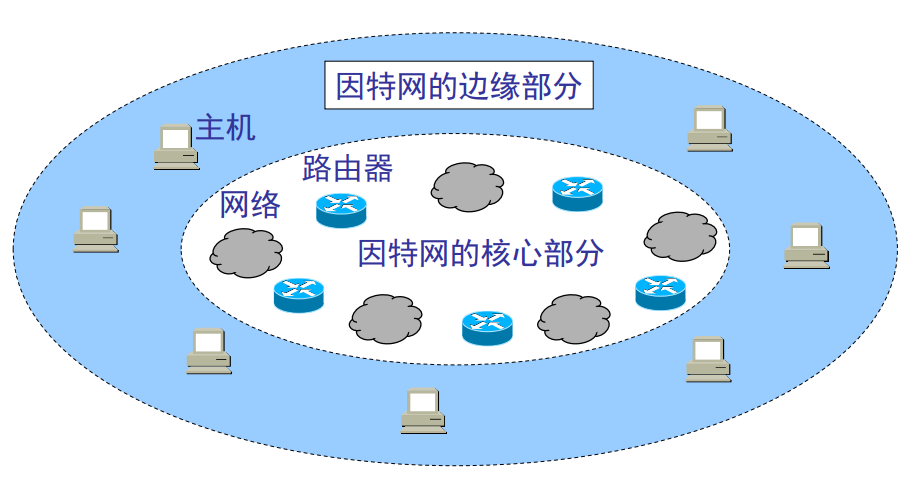

#### **_3. 电路交换、报文交换和分组交换_**

> Tips: “ **_交换_** ”就是按 照某种方式**动态地分配传输线路**的资源。

- **_电路交换_** 过程:整个报文的比特流连续的从源点直达终点

      1️⃣建立连接（尝试占用通信资源）
    
      2️⃣通信（一直占用通信资源）
    
      3️⃣释放连接（归还通信资源）

- **_报文交换_** 过程:**整个报文**先传送到相邻结点存储， 再转发到下一个结点
- **_分组交换_** 过程:报文**分组**后每个分组分别传送到相邻结点存储，再转发到下一个结点

  **_性能比较_ :**

  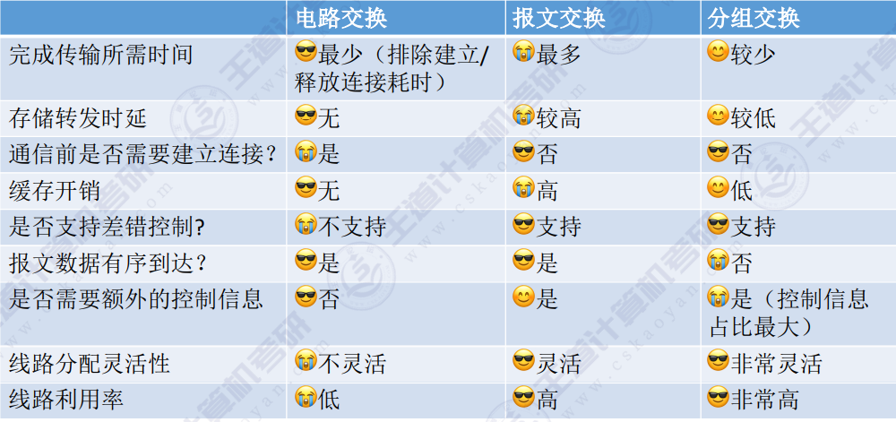

#### **_4. 计算机网络的分类_**

1. 按**分布范围**分类
   - **局域网 LAN** (Local Area Network) ：一般`<u>`10 公里`</u>`以内，一个企业可拥有一个或多个局域网
   - **城域网 MAN** (Metropolitan Area Network)： `<u>`5-50公里`</u>`范围，可以一个或几个单位拥有，也可以 是一个公用设施
   - **广域网 WAN** (Wide Area Network)：也称远程网， `<u>`几十到几千公里`</u>`，长距离（跨越不同城市或国家）运 送数据
   - (**无线）个人区域网** **PAN** (Personal Area Network) :范围`<u>`10m左右`</u>`

2. 按**使用者**分类
   - **公用网**——向公众开放的网络(_给钱就能用_)。如：办宽带、交手机话费即可使用的互联网
   - **专用网**——仅供某个组织内部使用的网络(_死活不给用_)。如：政府、军队、电力、银行的内部网络

3. 按**传输技术**分类
   - **广播式网络**——当一台计算机发送数据分组时，广播范围内所有计算机都会 收到该分组，并通过检查分组的目的地址决定是否接收该分组(Eg: 无线网)
   - **点对点网络**——数据只会从发送方“_点对点_”发到接收方，精准送达

4. 按**拓扑结构**分类

   |  结构  | 图示                                                         | 描述                                                         |
   | :----: | ------------------------------------------------------------ | ------------------------------------------------------------ |
   | 总线型 |  | 数据“**广播式**”传输； 存在“**总线争用**”问题                |
   |  环形  |  | 环形结构：数据“**广播式**”传输；通过“**令牌**”解决总线 争用问题，令牌顺环形依次传递，拿到令牌者可使用总线 |
   |  星形  | 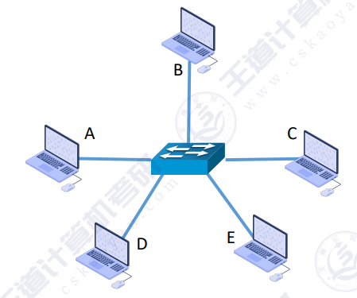 | 星形结构：由中央设备实现数据的“**点对点**”传输；不存在“总线争用”问题 |
   |  网状  | 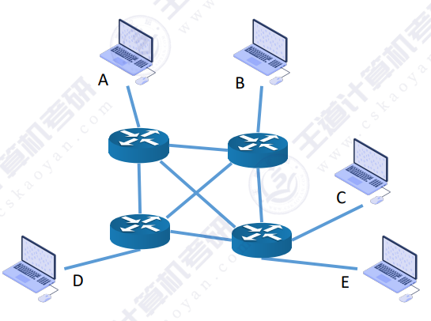 | 网状结构：数据通过各中间节点逐一存储转发； 属于“**点到点**”传输 |

#### **_5. 计算机网络的性能指标、时延的计算方法_**

> 性能指标包括:**速率**、**带宽**、**吞吐量**, **时延**、**时延带宽积**、**往返时延**, **信道利用率**

    **$存储单位换算:

1B(字节)=8bit(比特)$\*\*

|     存储单位换算      |   速率单位换算    |
| :-------------------: | :---------------: |
| $1K =2^{10} b=1024 b$ | $1kb/s = 10^3b/s$ |
|    $1M = 2^{20} b$    |   1Mb/s=10^6b/s   |
|    $1T = 2^{40} b$    |   1Gb/s=10^9b/s   |

1. **_速率_**(也叫数据率, 比特率, 数据传输速率)[**单位**bit/s, b/s, bps]
2. **带宽**(也叫最高数据率)[**单位**赫Hz,千赫kHz..., b/s, bit/s]
3. **吞吐量**(throughput)表示在单位时间内通过 某个网络（或信道、接口）的数据量
4. **时延**：数据从网络的一端到另一端所需的时间.

   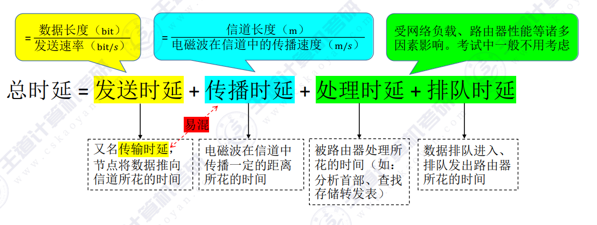

5. **时延带宽积**: 一条链路中，**已**从发送端**发出但尚未到达**接收端的**最大比特数**[**单位bit**]

   $$
   时延带宽积 = 传播时延 * 带宽
   $$

6. **往返时延RTT**（ Round-Trip Time ）：表示从发送方**发送完数据**，到发送方**收到来自接收方的确认**总共经历的时间(Eg:游戏延迟)。

   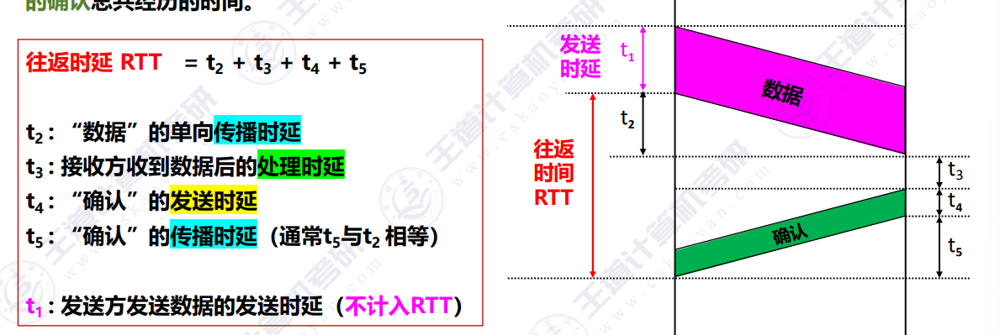

7. **信道利用率**

   $$
   信道利用率=有数据通过的时间/(有数据通过的时间+没有数据通过的时间)
   $$

   **例题 1(总时延计算):**

   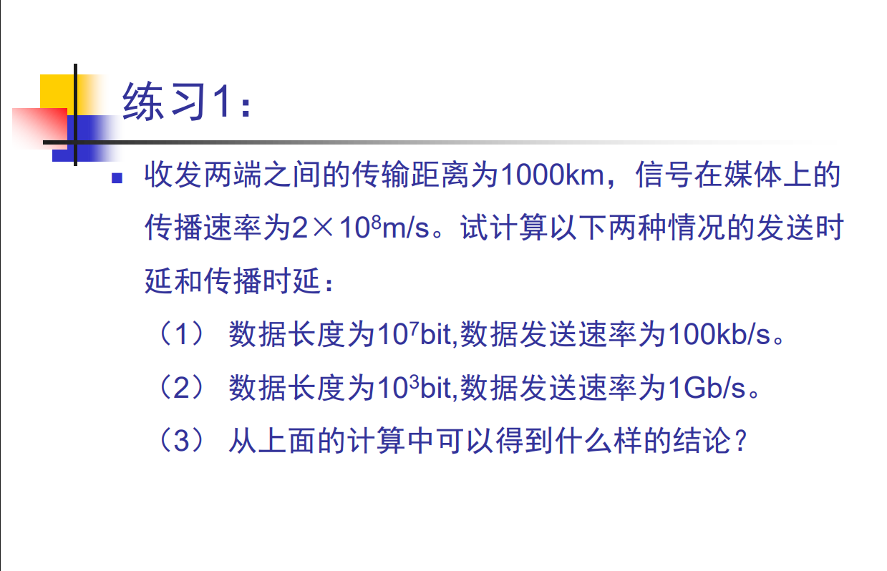

> **已知条件**：
>
> - 传播距离：$ d = 1000\ \text{km} = 10^6\ \text{m} $
> - 信号传播速率：$v = 2 \times 10^8\ \text{m/s}$
>
> ==解(1)==：
>
> $ L=10^7\ \text{bit} $，$ R=100\ \text{kb/s}=10^5\ \text{bit/s} $
>
> 1. 传播时延： $ t\_{\text{传播}} = \frac{10^6}{2 \times 10^8} = 5 \times 10^{-3}\ \text{s} = 5\ \text{ms} $
> 2. 发送时延：$ t\_{\text{传输}} = \frac{10^7}{10^5} = 100\ \text{s}$
> 3. 总时延： $t_{\text{总}} = 100 + 0.005 = 100.005\ \text{s}$
>
> ==解(2)==：
>
> $L=10^3\ \text{bit} $，$ R=1\ \text{Gb/s}=10^9\ \text{bit/s} $
>
> 1. 传播时延（与发送速率无关）：$ t\_{\text{传播}} = 5\ \text{ms} $
> 2. 发送时延： $t_{\text{传输}} = \frac{10^3}{10^9} = 10^{-6}\ \text{s} = 1\ \mu\text{s}$
> 3. 总时延：$ t\_{\text{总}} = 0.000001 + 0.005 = 0.005001\ \text{s}$

#### **_6. 网络协议三要素_**

- **语法** : 数据与控制信息的结构或格式。
- **语义** : 需要发出何种控制信息，完成何种动作以及做出何种响应。
- **同步** : 事件实现顺序的详细说明。

#### **_7. 五层体系结构以及TCP/IP体系结构、各层的功能_**

**体系结构:**

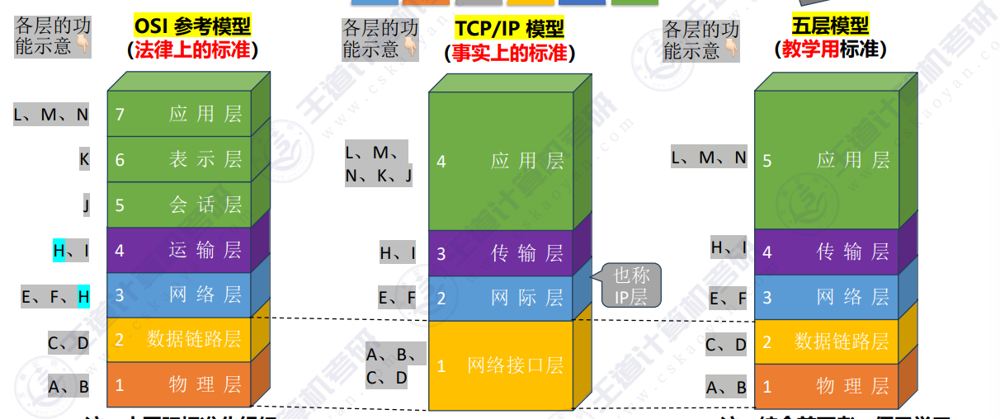

| 1）**物理层**主要负责在物理线路上传输**原始的二进制数据**；                                       |
| ------------------------------------------------------------------------------------------------- |
| 2）**数据链路层**主要负责在通信的**实体间**建立数据链路连接；                                     |
| 3）**网络层**主要负责创建**逻辑链路**，以及实现数据包的分片和重组，实现拥塞控制、网络互连等功能； |
| 4）**传输层**负责**向用户**提供端到端的通信服务，实现流量控制以及差错控制；                       |
| 5）**应用层**为应用程序提供了网络服务。                                                           |

## 第二章

#### **_1. 网络常见的传输介质有哪些？_**

- **导向型**:

| 导向型         | 分类/构成                                                                                                    | 特点                                                                                                         | 代表                     |
| -------------- | ------------------------------------------------------------------------------------------------------------ | ------------------------------------------------------------------------------------------------------------ | ------------------------ |
| **双绞线**     | 有屏蔽层->屏蔽双绞线(STP);` `无屏蔽层->非屏蔽双绞线(UTP)                                                  | 信号**衰减**厉害， 传输速率**低**，传输**距离短**                                                            | 早期电话线,网线          |
| **同轴电缆**   | 内导体(传输信号))+外导体屏蔽层(抗电磁干扰)                                                                   | 抗干扰能力**好**(屏蔽层),安装较麻烦、**造价高**                                                              | 早期局域网、早期有线电视 |
| **光纤(光缆)** | 纤芯(高折射率)+包层(低折射率)` `单模光纤(适合**长距离**传输)` `多模光纤(适合**近距离**传输,**损耗高**) | 抗干扰能力**非常好**。(利用**光的全反射**光信号对电磁干扰不敏感)` `信号传输**损耗小**` `传输**距离长** | 适于组建大规模网络       |

- **非导向型**

| 非导向型     | 特点                                            | 代表           |
| ------------ | ----------------------------------------------- | -------------- |
| **无限电波** | 穿透能力强、传输距离长、信号指向性弱            | 手机信号、WiFi |
| **微波通信** | 频率带宽高、信号指向性强、保密性差(容易被窃听） | 卫星通信       |

#### **_2. 就双方信息交互方法看，通信的三种基本方式（单工、半双工、全双工，生活中的实例）_**

| 数据通信方式     | 描述                                                    | 图示                                                         | 代表           |
| ---------------- | ------------------------------------------------------- | ------------------------------------------------------------ | -------------- |
| **单工通信**     | 只能有一个方向的通 信而没有反方向的交互                 | 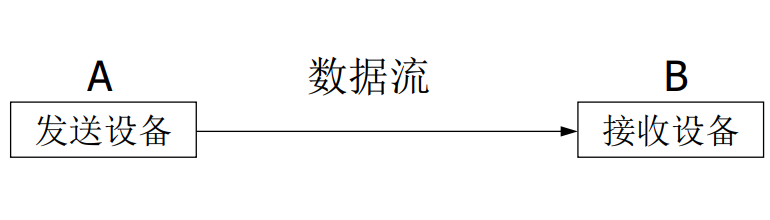 | 听广播和看电视 |
| **半双工通信**   | 通信的双方都 可以发送信息，但同一时刻只限于一个方向传输 | 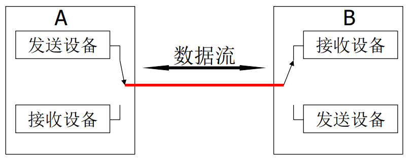 | 对讲机         |
| **双向同时通信** | 通信的双方可 以同时发送和接收信息                       | 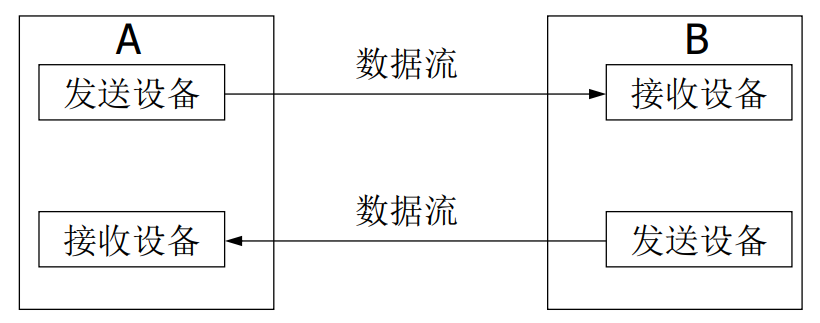 | 计算机之间通信 |

#### **_3. 奈氏准则和香农公式_**

- **奈氏准则**:对于一个 `<u>`理想低通信道`</u>`（**没有噪声**、带宽有限的信道）
  - _极限波特率_ = 2W （单位：波特，即 码元/秒）
  - $极限比特率=2*W*log_2K (b/s)$
  - $1码元(W)=log_2K(bit)$

>     W  是信道的频率带宽[单位Hz]

- **香农公式**:对于一个 **有噪声**、带宽有限的信道
  - $信噪比=10*log_{10}S/N(dB分贝)$ ( S:信号的功率; N:噪声的功率)[ `<u>`无单位`</u>` ]

- $极限比特率 = Wlog_2(1 + 𝑆/𝑁)[单位: b/s]$

#### **_4. 常用的宽带接入技术有哪些_**

- **数字用户线x DSL技术**
  - **ADSL** (Asymmetric Digital Subscriber Line)：**非对称数字用户线**
  - HDSL (High speed DSL) : 高速数字用户线
  - SDSL (Single-line DSL)：1 对线的数字用户线
  - VDSL (Very high speed DSL)：甚高速数字用户线
  - DSL (Digital Subscriber Line)：ISDN 用户线。
  - 第二代ADSL->更高的**数据率**,无缝速率自适应技术->**自适应地调整**数据率
- **光纤同轴混合网HFC**
  - **主要特点**:
    1. HFC网的主干线路采用光纤
    2. HFC 网采用结点体系结构
    3. HFC 网具有比 CATV 网更宽的频谱，且具有 双向传输功能
    4. 每个家庭要安装一个用户接口盒(机顶盒,电话机,电缆调制解调器)
- **(光纤到...)FTT x技术**
  - **光纤到家** FTTH (Fiber To The Home)
  - **光纤到大楼** FTTB (Fiber To The Building)
  - **光纤到路边** FTTC (Fiber To The Curb)

#### **_5. 信道复用技术_**

1. **频分复用 FDM** (Frequency Division Multiplexing):的所有用户在**同样的时间**占用**不同的带宽**资源
2. **时分复用TDM**(Time Division Multiplexing):将时间划分为一段段**等长的时分复用帧**（TDM 帧）。每一个时分复用的用户在每一个 TDM 帧中占用固定序号 的时隙。
3. **统计时分复用STDM**(Statistic TDM):改进的时分复用
4. **波分复用 WDM** (Wavelength Division Multiplexing):主要用于**光纤通信**，利用**不同的波长的光**在同一条光纤同时传输多路信号
5. **码分复用 CDM** (Code Division Multiplexing):各**用户**使用经过特殊挑选的**不同码型**，因此彼此不会造成干扰

## 第三章

#### **_1. 数据链路层的三个基本问题是什么？为什么要加以解决？具体如何解决的?_**

> [!TIP]
>
> **_注意要会CRC计算FCS的详细过程。接收方如何判断收到的帧是否有差错。_**

**三个基本问题**:==封装成帧== ==透明传输== ==差错控制==

- **封装成帧**: 在一段数据的前后分别 **添加首部和尾部**，然后就构成了一个帧。确定 帧的界限, 就是**帧定界**。
- **透明传输**: 即**不管输入什么字符**都可以 放在帧中传输过去。
- **差错控制**: **发现并解决**一个帧内部的**位错误**

| 基本问题     | 为什么要解决                                                                                                                                                                                                                                            | 如何解决                                                                                                                                                                 |
| ------------ | ------------------------------------------------------------------------------------------------------------------------------------------------------------------------------------------------------------------------------------------------------- | ------------------------------------------------------------------------------------------------------------------------------------------------------------------------ |
| **封装成帧** | 1. 如果**帧长度太小**，就可能出现网络上同时有两个帧在传播，就会产生`<u>`冲突（碰撞）`</u>`而造成网络`<u>`无法发送数据`</u>`。 ` `2. 如果**数据帧太长**就会出现有的工作长时间不能发送数据，而且可能超出接受端的缓冲区大小， 造成`<u>`缓冲溢出`</u>`。 | 每个以太网帧都有**最小的 大小64bytes最大不能超过1518bytes**，对于小于或者大于这个限制的以太网帧都可以视之为 **错误的数据帧**，一般的以太网转发设备会**丢弃**这些数据帧。 |
| **透明传输** | 1. 传送的帧是**文本文件**：所有字符都从键盘输入，不会出现与帧首尾定界控制符雷同字符， 可以实现透明传输。` ` 2. **非文本文件**（如程序或图像等）：出现数据与首尾定界符相同，部分数据就会丢弃。                                                        | **字节填充**(byte stuffing)或**字符填充**(character stuffing)—— 接收端的数据链路层在将数据送往网络层之前删除插入的**转义字符**。                                         |
| **差错控制** | 在传输过程中可能会产生**比特差错**：1 可能会 变成 0 , 而 0 也可能变成 1。                                                                                                                                                                               | **奇偶校验**和**循环冗余校验(CRC)**、**海明码**                                                                                                                          |

- **奇偶校验**
  - **奇校验**: 若传输的1的个数满足奇数个， 校验位（冗余位）记0，偶数个记1
  - **偶校验**：若传输的1的个数满足偶数个， 校验位（冗余位）记0，奇数个记1
  - **_特点_**-->只能检测出每列（或行）中**奇数个错**（例：每列有一个错时能检 测出来，若有两个错就 检测不出），**漏检率接近50%**

- **CRC循环冗余检验**
  - **特点**:
    - 可检测出所有小于等于校验位长度的**连续错误**；
    - 若选择合适的生成多项式，则可**纠正单比特错误**

  - **接收方判断**:
    - 若得出的**余数** R = 0，则判定这个帧没有差错，就接受(accept)
    - 若余数 R $\neq$ 0，则判定这个帧有差错，就丢弃

  - **计算方法**
    1. 事先约定**生成码P**（P(X)为生成多项式, 按幂转化为二进制码）冗余码**n**的位数为**P-1**位
    2. **传输的信息为M**, 在*M*后面添加n个0作为**被除数T**。
    3. 用得到**T**除以**P**，得出**商**是Q, 而**余数**是**R**（冗余码），余数R比除数P少1位，即R是n位。
    4. 码字为**M+R**（+为字符顺序连接符号）

  - **例 :**

  > **求循环冗余码( FCS )和码字**
  >
  > **已知: **要传输的信息 \( M = 101001 \)，约定的生成多项式为$P(X)=x^3+x^2+1$，求循环冗余码和码字
  >
  > - **生成码P**为 1101 ,**冗余码n**的位数为**4-1=3**位
  > - **传输的信息M**为 101001,**被除数T**为101001``000
  > - T/P=Q( 110101 ).....R( 001 )
  > - **码字**: 101001001, **冗余码**: 001
  > - 补充-->**除法过程**:
  >
  >   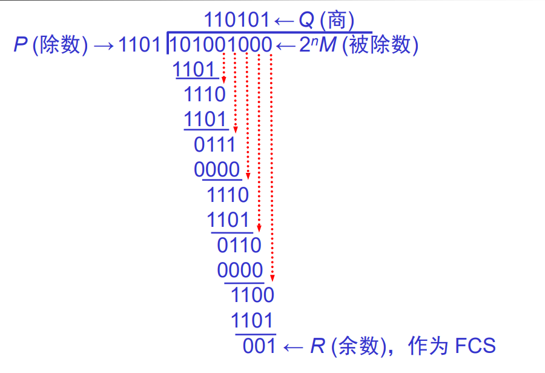

#### **_2. 字节填充和零比特填充_**

- **字节填充法**:->填充特殊字符

  数据部分: 1011``00000100010``000110111110``000000011110

  封装好的帧:``000000011011``00011011``000001000100``0011011 ``000110111110``00011011``000000011110``00000100

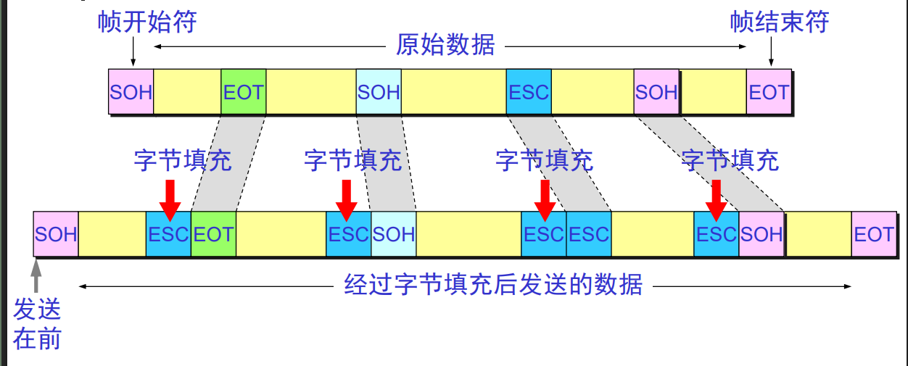

- **零比特填充法**:->数据部分每遇到连续的5个1，就填充⼀个0
  - 发送方需要对帧的数据部分进行处理，每当遇到连续5个1，就**填充**一个0
  - 接受方需要对帧的数据部分进行逆处理，每当遇到连续5个1，就**删掉**后面的0

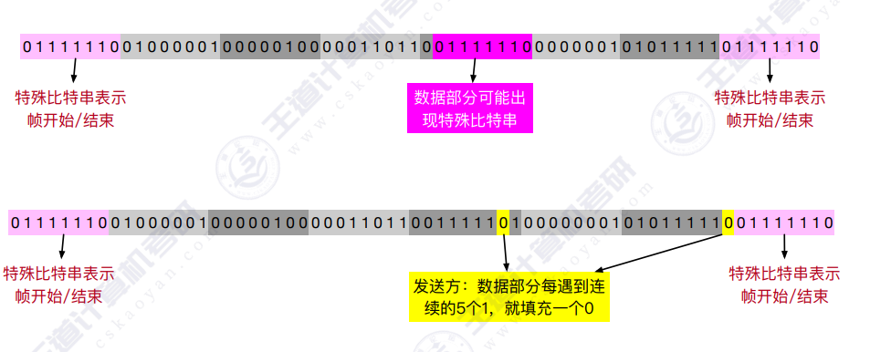

#### **_3. 网络适配器的作用是什么？它工作在哪一层？_**

> [!TIP]
>
> 1. 适配器(网卡)的重要**功能**：
>    - 进行串行/并行转换；
>    - 对数据进行缓存；
>    - 在计算机的操作系统安装设备驱动程序；
>    - 实现以太网协议。
>
> 2. 工作层: 工作在数据链路层和物理层

#### **_4. 试从工作层次和功能上比较和分析集线器、交换机和路由器的区别与联系_**

> [!TIP]
>
> **_网络层及以下各层所使用的的设备，这些设备的作用是什么_**

> **碰撞域**（**冲突域**）：连接在同一导线上的所有 工作站集合（同一物理网段上所有节点集合）`<u>`域内争用端口`</u>`，在任意时刻，只能有一个站发送数据
>
> **广播域**：接收同样广播信息的节点集合

- **区别 :**

| 设备       | 工作层次              | 核心功能                         | 数据转发依据       | 冲突域 / 广播域影响                                      | 通信方式   |
| ---------- | --------------------- | -------------------------------- | ------------------ | -------------------------------------------------------- | ---------- |
| **集线器** | 物理层（第 1 层）     | 把收到的电信号**复制到所有接口** | 无（仅做信号放大） | 所有接口属于**同一个冲突域 + 同一个广播域**              | **半双工** |
| **交**换机 | 数据链路层（第 2 层） | 依据**MAC 地址表**转发数据       | 设备的 MAC 地址    | 每个接口是**独立冲突域**，但所有接口属于**同一个广播域** | **全双工** |
| **路由器** | 网络层（第 3 层）     | 依据**路由表**转发 IP 分组       | 目标 IP 地址       | 每个接口是**独立冲突域 + 独立广播域**                    |            |

- **联系: **从底层到高层逐层支撑数据传输，让设备之间的通信更有序、更快、更安全
- **例**:

<section style="display:flex">
  <!-- 想要几张图并排，就在此处插入几个  标签: </img> -->   
  </img>
  </img> 
  </img>
</section>

**答案** (1) `<u>`[ **4** ]`</u>` (2) `<u>`[ **3** ]`</u>` (3) `<u>`[ 1+5= **6** 1+2=**3** ]`</u>`

#### **_5. CSMA/CD协议(IEEE802.3以太网采用的介质访问控制协议)要点：P88_**

> **CSMA/CD **: 载波监听 多点接入 / 碰撞检测

**要点 : **->_先听后发，边听边发，冲突停发，随机重发_

- **多点接入**：表示许多计算机以**多点接入**的方式连接在**一根总线**上。
- **载波监听**：是指每一个站在发送数据之前先要**检测**一下总线上是否有**其他计算机**在发送数据，如果有， 则暂时不要发送数据，**以免发生碰撞**
- **碰撞检测**：就是计算机**边发送数据边检测**信道上的信号电压大小

**特点 :**

- 只能进行双向交替通信（**半双工通信**）
- 每个站在发送数据之后的一小段时间内，存在着**遭遇碰撞的可能性**
- **发送的不确定性**使整个以太网的平均通信量远小于以太网的最高数据率

#### **_6. 交换机的自学习功能_**

- **交换表**---**初始为空**,记录【MAC地址，端口号】的对应关系
- 每**收到一个帧**，就将**“发送方"**的【MAC地址，端口号】更新到**交换表**
- 1. 如果**不知道"接收方"在哪里**,就把帧**广播**到**除入口以外的其他端口**
  2. 如果**知道"接收方"在哪里**,就把帧**精准转发至某个端口**
- 交换表中每个表项都有**“有效时间"**，过期表项**自动作废**, 以防某些节点拔线跑路

#### **_7. MAC地址_**

- 硬件地址, 物理地址
- 固化在适配器ROM中的地址
- 48位(6字节) : 如 `EC-55-F9-78-1E-53`

#### **_8. 冲突域、广播域的概念_**

- **碰撞域**（**冲突域**）：连接在同一导线上的所有 工作站集合（同一物理网段上所有节点集合）`<u>`域内争用端口`</u>`，在任意时刻，只能有一个站发送数据
- **广播域**：接收同样广播信息的节点集合

## 第四章

#### **_1. 网络层提供的两种服务_**

- **面向连接**:面向连接的服务在端系统之间建立通过网络的**虚电路**， 在发送任何数据之前，要求建**立会话连接**（与拨打电话类似），然后才能开始**传送数据**，传送完成后需要**释放连接**

  > **虚电路**表示这只是一条**逻辑上的连接**，分组都沿着这条逻辑连接按照**存储转发方式**传送，而 并不是真正建立了一条物理连接

- **无连接**（**无面向连接**）：**不要求**发送方和接收方之间的**会话连接**。发送方只是简单地开始向目的地发送数据分组（称为数据报），**不需要提前与目的系统建立连接**

#### **_2. IP地址_**

> [!TIP]
>
> （122-130注意划分子网和地址块划分方法！地址聚合方法）
>
> 分类IP地址、CIDR、掩码、IP地址的特点
>
> 分类IP地址划分子网时不适用全0和全1的子网，但是CIDR可以使用全0和全1的子网
>
> 习题4-19（P204）

1. **分类IP地址: ** 将IP地址划分为若干个固定类，每一类地址由**网络号(net-id)和主机号(host-id)**构成--->==IP地址::={<网络号>,<主机号>}==
   - 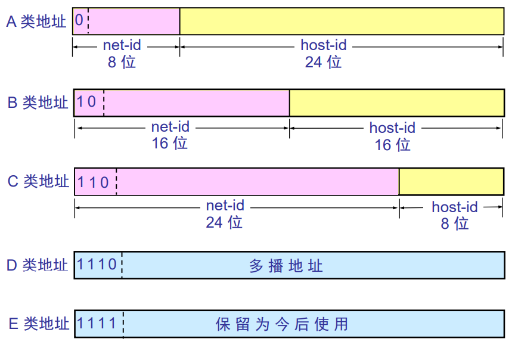
   - **特点: **
     - **网络号和主机号不能全0或全1，每类地址中最小网络地址为1**,可用最小网络地址为： A类**1**.0.0.0， B类**128.1**.0.0，C类**192.0.1**.0
     - 网络号127**保留**为本地环回测试 地址，如 `127.0.0.1`
     - **全0**的主机号字段表示该IP地址是“本主机”所连接到的**网络地址**
     - **全1**的主机号字段表示该网络上**所有主机**

2. **CIDR(无分类域间路由选择):** ==IP地址::={<网络前缀>,<主机号>}==
   - **特点: **
     - CIDR 消除了传统的 A 类、B 类和 C 类地址以及划分子网的概念，因而可以更加**有效地分配 IPv4 的地址空间**
     - 使用各种长度的**“网络前缀”**来代替分类地址中的网络号和子网号
     - IP 地址从三级编址（使用子网掩码）又回到了**两级编址**
   - **CIDR地址块: **网络**前缀都相同**的连续的 IP 地址组成“CIDR 地址块”
     - `128.14.32.0/20` 表示的地址块共有$ 2^{12}$ 个地址（因为斜线后面的 20 是网络前缀的位数 `255.255.11110000.00000000`所以这个地址的主机号是 12 位）。
     - `128.14.32.0/20` 地址块的**最小**地址：`128.14.32.0`
     - `128.14.32.0/20` 地址块的**最大**地址：`128.14.47.255`
     - **全 0** 和**全 1** 的主机号地址一般不使用

3. **子网掩码**
   - **特点: **
     - 斜线后面的数字就是**地址掩码1的个数**
     - **路由器在和相邻路由器交换路由信息**时，必须把自己 所在网络（或子网）的子网掩码告诉相邻路由器
     - 路由器的路由表中的每一个项目，除了要给出**目的网络地址**外，还必须同时给出**该网络的子网掩码**

4. **IP地址的特点**
   - IP地址是一个**分等级**的地址结构，每一个 IP地址由**网络前缀**和**主机号**构成
   - IP地址是标志**一个主机（或路由器）** 和**一条链路**的**接口**
   - 用转发器或交换机连接起来的若干个局域网仍为一个网络，因此这些局域网都**具有同样的网络号(net-id)**
   - 所有分配到网络号 net-id 的网络(无视地理范围), 都是**平等**的

5. **习题4-19（P204）**

   > **题设:** 某单位分配到一个地址块 `129.250/16`，该单位共有 4000 台计算机，且这些计算机平均分布在 16 个不同的地点。需要为这 16 个地点各自分配一个地址块，并计算出每个地址块中 IP 地址的最小值和最大值。
   >
   > **解: **
   >
   > 1. 网络位 16 位, 需要划分 16 个地点, 需要借 $log_216=4$ 位作为子网位, 则**子网掩码**为 `255.255.11110000.0`->`255.255.240.0`
   > 2. 分配地址块, 子网增量$256-240=16$, 每个 `/20`子网包含IP数$2^{(32-20)}=4096$个(满足每个地点250台)
   > 3. 第n个地点,地址块为 `129.250.1111xxxx.0/20`, 最小值 `129.250.240.1`, 最大值 `129.250.255.254`
   > 4. **地址范围**为 `129.250.240.1 `~` 129.250.255.254`

#### **_3. ARP协议工作原理_**

> **ARP:地址解析协议(Address Resolution Protocol)**, 实现由**IP地址**到**MAC地址**的自动解析

1. **工作原理:**
   1. 主机 A 做好向主机 B 发送 IP 数据报的准备；
   2. 主机 A 查询自身的 ARP 高速缓存，判断缓存中是否存在主机 B 对应的 IP 地址；
      - 若 ARP 高速缓存中**存在**主机 B 的 IP 地址，直接从 ARP 缓存中提取该 IP 地址对应的硬件地址；
        1. 将提取到的硬件地址**写入** MAC 帧的目的地址字段；
        1. 通过局域网将该 MAC 帧发送到目标硬件地址，完成数据报的初步转发；
      - 若 ARP 高速缓存中**没有**主机 B 的 IP 地址，主机 A 会先查找本局域网上某个路由器的 MAC 地址；
        - 随后将待发送的分组发送给该路由器，由路由器继续完成后续的转发流程。

2. **使用情况**
   - 主机(**发送方**)<-**ARP**->主机(**接收方**)
   - 主机<-->路由器
   - 路由器<-->主机
   - 路由器<-->路由器

3. **例**:

   > **题设:**主机A发送数据报给主机B，途径**5个路由器**，试问在IP 数据报的发送过程中总共使用了几次ARP协议
   >
   > **解:**
   >
   > 1. **发送方是主机**，要把 IP 数据报发送到另一个网络上的一个主机，先用 ARP **找到本网络**上的一个路由器 的硬件地址
   > 2. 主机A—>R1—>R2—>R3—>R4—>R5—>主机B
   > 3. 共**6**次, 主机1 次, 路由器5 次

#### **_4. IP分组转发的算法_**

> [!TIP]
>
> （P140-142，例4-2）

[**例4-2**]

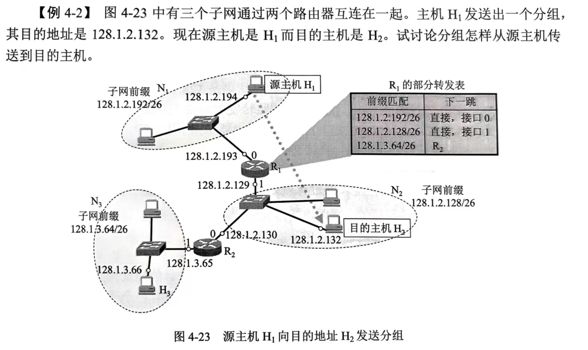

**解: **

1. **源主机$H_1$的本地判断**
   - $H_1$的IP地址为 `128.1.2.194`, 子网前缀为 `128.1.2.192/26`, 所在子网的地址范围是 `128.1.2.192`~`128.1.2.255`
   - 目的地址 `128.1.2.132`不在范围内-->$H_1$将分组发送给**连接在本网络上的路由器$R_1$**
2. **路由器$R_1$的转发**
   - $R_1$查询自身转发表:
     - 目的地址 `128.1.2.132`匹配前缀 `128.1.2.128/26`(该前缀的范围为 `128.1.2.128`~`128.1.2.191`)
     - 转发表该前缀对应下一跳为"直接, 接口1"
   - $R_1$将分组从接口1**转发**到子网$N_2$(前缀 `128.1.2.128/26`)
3. **子网$N_2$内的交付**
   - 分组在$N_2$内通过广播,最终将分组交付给主机$H_2$
4. **整个传输路径**
   - H₁ → 子网$N₁$ → 路由器R₁（接口0→接口1） → 子网N₂ → 目的主机H₂

#### **_5. RIP特点、工作原理以及距离向量算法_**

1. **RIP(路由信息协议Routing Information Protocol) **
   - 一种分布式的基于**距离向量**的路由选择协议
   - 要求网络中的**每一个路由器都要维护从它自已到其他每一个目的网络的距离记录**。

2. **"距离(跳数)"的定义**
   1. 从一个路由器到**直接连接**的网络的距离定义为1, 到**非直接连接的网络**的距离定义为经过的路由器数
   2. 一条路径最多只能包含**15 个路由器**, 只适用于**小型网络**
   3. 多条路径下,RIP选择**跳数最少的路径**

3. **RIP特点**
   1. 仅和**相邻路由器交换信息**
   2. 交换的信息是当前本路由器所知道的**全部信息（即自己的路由表）**
   3. 按**固定的时间间隔**交换路由信息
   4. **坏消息传播的慢**

4. **工作原理**
   - 路由器在*刚刚开始*工作时，**只知道到直接连接的**网络的距离 （此距离定义为1）。
   - _以后_，每一个路由器也**只和数目非常有限的相邻路由器**交换并更新路由信息。
   - 经过*若干次更新*后，**所有的**路由器最终都会知道到达本自治系统中**任何一个**网络的最短距离和下一跳路由器的地址。

     > **自治系统AS**(Autonomous System):在单一的技术管理下的**一组路由器**

5. **距离向量算法**
   1. **第一步：修改地址**
      - **对地址为 X 的相邻路由器**发来的 RIP 报文，将 “下一跳字段中的地址都改为 X”，所有 “距离” 字段的值 + 1。
      - 示例：若 X 路由器发来的项目是 "Net2，3，Y"==[<目的网络>,<距离>,<下一跳路由> ]==，则改为 "Net2，4，X"。

   2. **第二步：更新本路由信息**
      - 若原来路由表中**没有**目的网络 Net，则把该项目**添加到路由表**中；
      - 若有目的网络 Net：
        - 若下一跳路由器地址**是 X**，把收到的项目**替换**原路由表中项目；
        - 若下一跳路由器地址**不是 X**，且收到的项目中距离**小于**路由表中的距离，则**更新**；否则什么也不做。

   3. **超时处理**：若 **3 分钟没有收到**相邻路由器的更新路由表，则把此相邻路由器记为**不可达的路由器**（距离置为 16）。
   4. **例:**已知路由器$R_6$的路由表，现收到相邻路由器$R_4$发来的路由更新信息，试更新路由器$R_6$的路由表：

      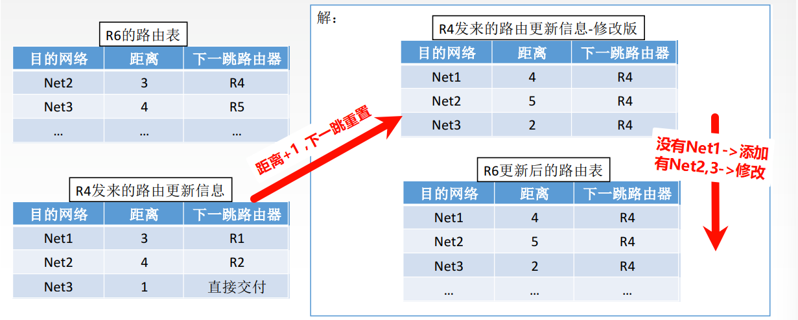

#### **_6. OSPF的特点和基本工作原理_**

1. **OSPF(开放最短路径优先Open Shortest Path First): **是一个分布式的**链路状态协议**
2. **三个要点**
   1. **信息发送范围: **向**本自治系统中**所有路由器发送信息（方法：**洪泛法**）
   2. **发送的信息内容：**只发送与本路由器**相邻**的所有路由器的链路状态（"链路状态”指本路由器与哪些路由器相邻，及链路的“度量"metric）;
   3. **发送时机**：只有当链路状态**发生变化**时，才用洪泛法向所有路由器发送此信息。
   4. **特点: **
      - 每隔30min，要**刷新**一次数据库中的链路状态
      - 当**互联网规模很大**时，OSPF 协议要比距离向量协议 RIP **好得多**
      - OSPF不存在坏消息传的慢的问题，它的**收敛速度很快**

3. **工作原理**

   > **链路状态数据库: **全网的拓扑结构图, 全网内一致, 能较快的更新链路状态信息
   >
   > **OSPF区域: **
   >
   > - 将一个自治系统**划分**若干个更小的范围
   > - 一个区域内部的路由器只知道**本区域内**的完整网络拓扑
   > - 上层叫**主干区域**,标识符规定为 `0.0.0.0`, 用来联通下层区域

   **初始链路状态同步**
   1. **邻居发现与链路度量配置**：路由器**发现相邻节点**并**建立邻居关系**，同时为与各邻居的链路**配置对应的度量值**(记忆: 认邻居, 认路, 标距离)
   2. **链路状态摘要交互**：路由器向邻居发送**数据库描述**分组，传递自身链路状态数据库的条目摘要(邻居间唠嗑,交换信息)
   3. **链路状态请求与更新**：邻居基于摘要，通过链路状态请求获取自身缺失或更新的链路状态信息；源路由器以链路状态更新响应，邻居则通过链路状态确认分组完成同步，最终**构建全网一致的链路状态数据库**(上传已知信息,合并出结果, 给邻居确认)

   **链路状态变更处理**
   1. **洪泛式更新**：状态变更的路由器以洪泛方式向自治系统内所有路由器**广播新的链路状态**(广播发信息)
   2. **确认与拓扑更新**：其他路由器接收后**确认**，完成链路状态数据库的更新(各自确认)
   3. **最短路径计算**：各路由器基于更新后的链路状态数据库，采用 Dijkstra 算法重新计算至各节点的**最短路径**，生成**新的路由表**(算最短路径)

   > RIP和OSPF都是内部网关协议, BGP为外部(或边界)网关协议

#### **_7. BGP路由_**

- BGP 是**不同自治系统**的路由器之间交换路由信息的协议
- 一个自治系统中有**两种**不同功能路由器：边界路由器（边界网关）和内部路由器
- 一个AS自治系统 至少要有一个 BGP边界路由器 和相邻AS直接相连
- BGP 只能是力求寻找一条**能够到达目的网络且比较好的路由**（不能兜圈子），而**并非**要寻找一条最佳路由

## 第五章

#### **_1. 传输层的功能_**

- 传输层的功能是保证数据**可靠地从发送结点发送到目标结点**
- 为端到端连接提供**流量控制**、**差错控制**、**服务质量**等管理服务

#### **_2. UDP的特点，TCP的特点_**

- **UDP(用户数据报协议 User Datagram Protocol): **主要用来支持那些需要**在计算机之间**传输数据的**网络应用**的传输协议
  - 在数据传送前**不需要先建立连接**。目的主机收到UDP报文后，也**不需要给出确认**。因此提供的是==不可靠交付==
  - UDP简单，开销小，某些情况(网络视频会议系统)下是**最有效**的工作方式
  - **支持一对一、一对多、多对一和多对多**
- **TCP(传输控制协议 Transmission Control Protocol):**为应用提供一些“低级”功能，是**执行特定任务的**应用协议
  - **提供==可靠的==、面向连接的服务**，在数据传送前**需要**先建立连接，目的主机收到UDP报文后，**需要**给出确认
  - **开销增加**，如确认、流量控制、计时器以及连接管理等，使首部增大，占用处理机资源
  - **TCP仅支持一对一**

#### **_3. 可靠传输的工作原理_**

1. **停止等待协议**

   <section style="display:flex">
   </img>
   </img>
   </section>
   - **注意点:**
     - 在发送完一个分组后，必须暂时**保留已发送**的分组的副本
     - 分组和确认分组都必须进行**编号**
     - 超时计时器的**重传时间应当比数据在分组传输的平均往返时间更长**
   - **可靠通信的实现**
     - **确认和重传机制**，可以在不可靠的传输网络上实现可靠的通信
     - **自动重传请求ARQ** (Automatic Repeat reQuest)表明重传的请求是**自动进行**的, 接收方**不需要**请求发送方重传某个出错的分组
   - **优缺点:**
     - 优点**简单**
     - 缺点**信道利用率太低**-->**改进:**流水线传输,**连续发送**多个分组

2. **连续ARQ协议**

   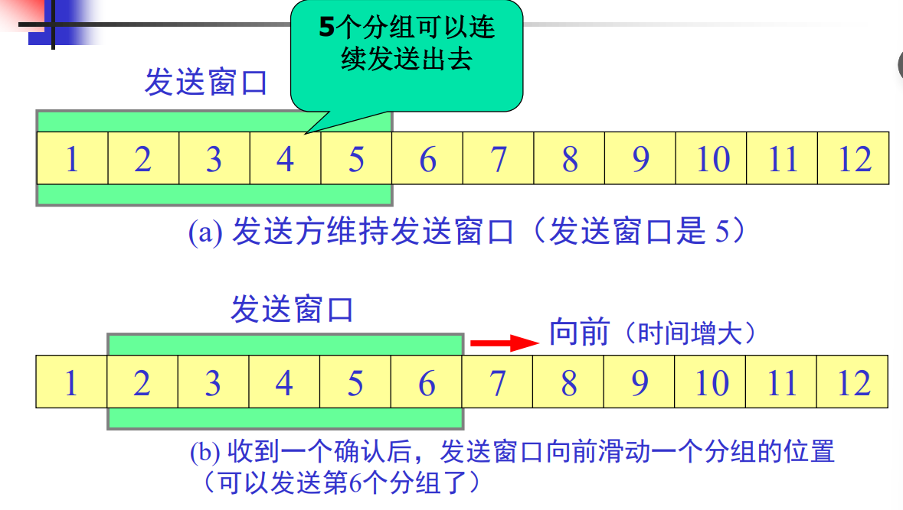
   - **累积确认**
     - 不必对收到的分组逐个发送确认，而是对**按序到达的最后一个分组**发送确认, 表示到**这个分组为止的所有分组都已正确收到了**
     - **优势: **容易实现, 即使丢失也不必重传
     - **缺点:** 不能向发送方反映出接收方已经正 确收到的所有分组的信息
   - **Go-back-N(回退 N)**
     - 表示需要再退回来**重传已发送过的** N 个分组
     - 如果发送方发送了前 5 个分组，而中间的*第 3 个分组丢失*了。这时接收方只能对前两个分组发出确认。发送方无法知道后面三个分组的下落，而只好把后面的三个分组*都再重传一次*
   - **可靠通信的实现**
     - TCP 连接的每一端都必须设有**两个窗口**(发送窗口, 接收窗口)
     - TCP 的可靠传输机制用**字节的序号**进行控制
     - TCP 两端的四个窗口经常处于**动态变化**之中, 往返时间 RTT 也是**动态**的, 需要使用特定算法进行估算

#### **_4. TCP可靠传输的实现_**

1. **以字节为单位的滑动窗口**

   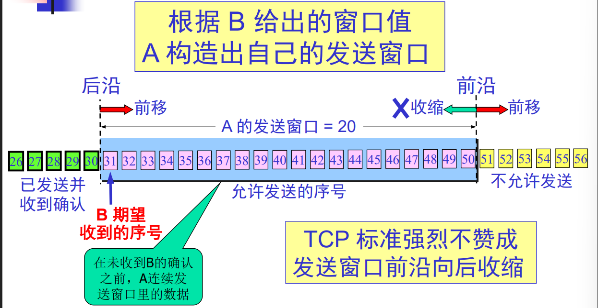
   1. **A的发送窗口**
      - 发送窗口的位置由**窗口前沿**和**后沿**的位置决定
      - 发送窗口的**后沿变化有两种情况**：不动（没有收到新的确认）和前移（收到了新的确认)
      - 发送窗口的**前沿有可能向后收缩**，由于**对方**通知的窗口缩小

   2. **工作过程**

      > 状态指针: $P_1$-->之前的数据已发送并确认; $P_3$-->之后的数据是不允许发送的

      <section>
        <!-- 想要几张图并排，就在此处插入几个  标签: </img> -->   
        </img>
        </img> <!-- 单独设置图片的宽度为200px -->
        </img>
      </section>

   3. **注意:**
      - A 的发送窗口和 B 的接收窗口**不一定一样大**（因为有一定的时间滞后）
      - TCP 标准没有规定对不按序到达的数据应如何处理。 通常是**先临时存放在接收窗口**中，等到字节流中所**缺少的字节收到后**，再**按序交付**上层的应用进程
      - TCP 要求接收方必须有**累积确认**的功能，这样可以减小传输开销

2. **超时重传时间的选择**
   - TCP**每**发送一个报文段，就对这个报文段**设置一次计时器**。只要计时器设置的重传时间到但还没有收到确认， 就要重传这一报文段
   - 采用了一种自适应算法，**记录**一个报文**发出**的时间， 以及**收到的相应的确认**的时间

3. **选择确认SACK(Selective ACK)**
   - 接收方**收到了**和前面的字节流**不连续**的两个字节块
   - 如果这些字节的**序号都在接收窗口之内**，那么接收方就**先收下**这些数据，但要把这些信息准确地**告诉发送方**，使发送方**不要再重复发送**这些已收到的数据

#### **_5. TCP流量控制(包括超时重传时间的选择)_**

1. **流量控制(flow control)**就是让发送方的发送速率**不要太快**，既要让接收方来得及接收，也不要使网络发生拥塞
2. 利用**滑动窗口机制**可以很方便地在 TCP 连接上实现流量控制
3. **持续计时器:**
   - TCP 为每一个连接设有一个持续计时器, 只要 TCP 连接的一方**收到对方的零窗口通知**，就**启动**持续计时器
   - 若持续计时器设置的**时间到期**，就**发送**一个**零窗口**探测报文段, 在对方确认后报文段为**窗口值**
   - 窗口为0-->收到这个报文段的一方就**重新设置**持续计时器; 不为0 ,继续数据传输
4. 可以用不同的机制来控制 TCP 报文段的**发送时机**

#### **_6. TCP拥塞控制方法_**

1. **慢开始和拥塞避免**
   - **核心: 拥塞窗口(cwnd)**
     - 发送方维护的状态变量(发送量上限)，大小**由网络拥塞程度决定**，**动态变化**(越堵越小,越顺越大)
     - 发送窗口$\leq$拥塞窗口
   - **慢开始: **由小到大**逐渐增大**注入到网络中的数据字节数（**指数级**逐渐增大拥塞窗口）
   - **拥塞避免:** 在拥塞避免阶段把**拥塞窗口控制为按线性规律增长**，使网络比较**不容易出现拥塞**

2. **快重传和快恢复**
   1. 要求接收方每收到一个失序的报文段后就**立即发出重复确认**。
   2. 发送方只要一连收到三个重复确认就应当**立即重传对方尚未收到的报文段**

      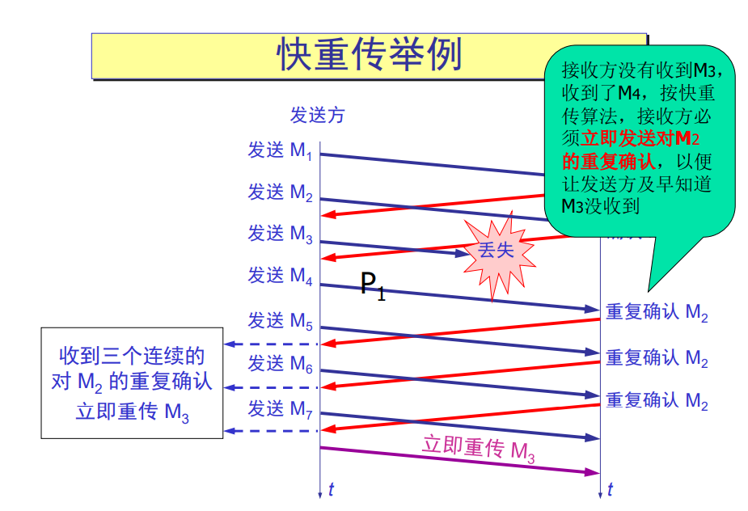

#### **_7. 发送方如何感知网络存在拥塞？发送方如何改变发送速率？[未提及,不准备]_**

#### **_8. 流量控制与拥塞控制的主要区别是什么？_**

|          | 流量控制                                                         | 拥塞控制                                               |
| -------- | ---------------------------------------------------------------- | ------------------------------------------------------ |
| 控制范围 | **全局性过程**，涉及所有主机、路由器及影响网络传输性能的所有因素 | **点对点过程**，仅针对给定的发送端与接收端之间的通信量 |
| 控制目的 | 前提是**“网络能承受现有负荷”**，核心是避免网络整体拥塞           | 目的是**抑制发送端速率**，确保接收端来得及接收数据     |

#### **_9. TCP连接管理（三次握手和四次挥手）_**

- **三次握手**-->客户**主动**与服务器建立连接
  - **第一次握手: **客户从 `CLOSED`状态进入 `SYN-SENT`状态，向服务器发送**SYN 报文段**（携带客户的初始序列号），请求建立连接；服务器处于 `LISTEN`（监听）状态，收到报文后进入 `SYN-RCVD`状态
  - **第二次握手：**服务器向客户发送 `SYN+ACK` 报文段（确认客户的请求，同时携带服务器的初始序列号）
  - **第三次握手**：客户收到确认后，进入 `ESTABLISHED`（连接建立）状态，向服务器发送**ACK 报文段**（确认服务器的请求）；服务器收到该确认后，也进入 `ESTABLISHED`状态

- **四次挥手**-->客户主动关闭,释放连接
  - **第一次挥手**：客户 A 从 `ESTABLISHED`状态进入 “主动关闭” 流程，向 B 发送**FIN 报文段**（请求释放连接），停止向 B 发送数据；B 收到后通知上层应用进程，此时 A→B 的连接释放（TCP 进入 “半关闭” 状态，B 仍可向 A 发数据）
  - **第二次挥手:** 服务器 B 向 A 发送**ACK 报文段**（确认 A 的释放请求）
  - **第三次挥手:** 若服务器 B 无数据需向 A 发送，也发起关闭流程，向 A 发送**FIN 报文段**（请求释放 B→A 的连接）
  - **第四次挥手:** 客户 A 收到 B 的 **FIN** 后，向 B 发送**ACK 报文段**（确认 B 的释放请求）；服务器 B 收到确认后关闭连接，A 等待一段时间（确保 B 收到确认）后也关闭连接

- <section style="display:flex;">
    <!-- 想要几张图并排，就在此处插入几个  标签: </img> -->   
    </img>
    </img>
  </section>

## 第六章

#### **_1. 应用层主要有哪些协议（HTTP、FTP、DNS......）？这些协议的作用是什么？分别基于哪些运输层协议。_**

#### **_2. HTTP操作过程、HTTP代理服务器_**

例如：一名学生A希望访问网站www.tust.edu.cn，学生A在其浏览器中输入http://www.tust.edu.cn并按回车，直到baidu的网站首页显示在其浏览器中，请问： 在此过程中，按照TCP/IP参考模型，从应用层到网际层都用到了哪些协议，每个协议所起的作用是什么？

协议及其功能如下:

(1)应用层:

HTTP:WWW访问协议.

DNS:域名解析.

(2)传输层:

TCP:在客户和服务器之间建立连接,提供可靠的数据传输.

UDP:为应用层提供无连接的传输服务,实现数据包的快速传输

(3)网络层:

IP:进行路由选择.

ICMP:提供网络传输中的差错检测.

ARP:将目的IP地址映射成物理MAC地址.

## 习题

3-07,3-08

4-18，4-25,4-26，4-37

5-21,5-37,5-38,5-39#

#### **[题 3-07]**

- **题设 :**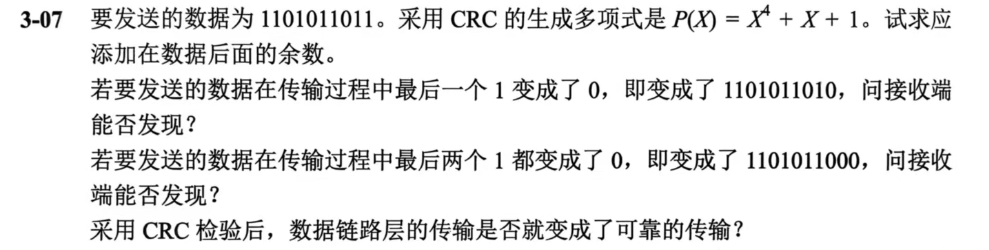
- > **解 :**
  >
  > (1) 依据生成多项式, 得生成码 `10011`, 被除数 `1101011011+0000`, 进行模2除运算得余数 `0110`
  >
  > (2) **最后一个 1 变 0**, 发送的帧为 `1101011010+0110`, 与 `10011`做模2除法,余数不为0, **接收端能发现错误**
  >
  > (3) **最后两个 1 变 0**, 发送得帧为 `1101011000+0110`, 与 `10011`做模2除法, 余数不为0, **接收端能发现错误**
  >
  > (4) 否. CRC 仅能**检测传输中的错误**，但无法纠正错误; 若错误导致帧的余数**恰好为 0**, 错误会被漏检

#### **[题3-08]**

- **题设 :**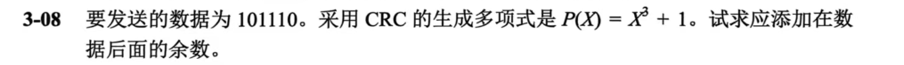
- > **解 :**
  >
  > 由生成多项式, 得生成码为 `1001`, 被除数为 `101110+000`, 进行模2除运算得余数 `011`

#### **[题4-18]**

- **题设 :**

  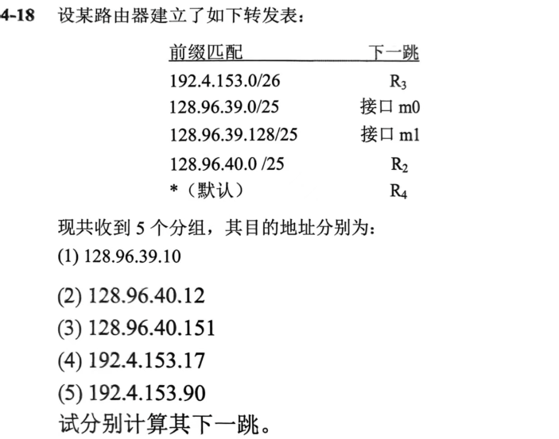

- > **解 :**
  >
  > 根据前缀匹配和掩码位数, 求得各对应得地址范围
  >
  > `192. 4.153.0/26`-->192.4.153.0~192.4.153.63
  >
  > `128.96.39. 0 /25`-->128.96.39.0~128.96.39.127
  >
  > `128.96.39.128/25`->128.96.39.128~128.96.39.255
  >
  > `128.96.40. 0 /25`->128.96.40.0~128.96.40.127
  >
  > 由目的地址寻找符合范围
  >
  > **答案: **接口 m0 R2 R4 R3 R4

#### **[题4-25]**

- **题设 :**

  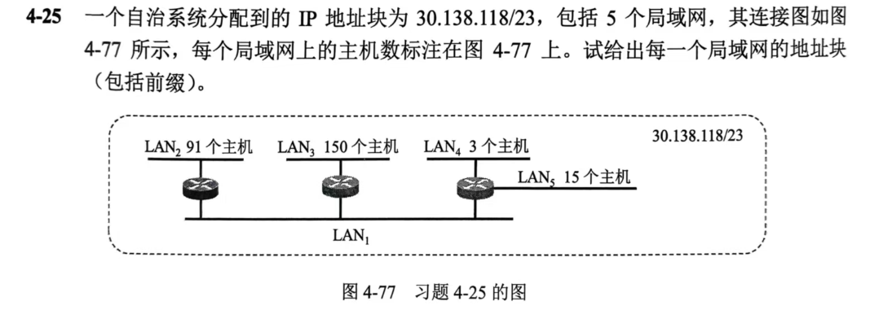

- > **解 :**

#### **[题4-26]**

- **题设 :**

  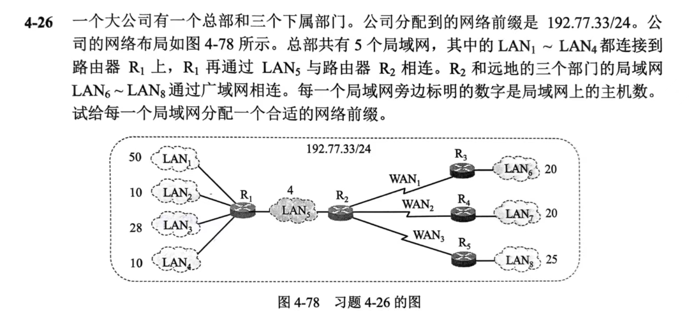

- > **解 :**

#### **[题4-37]**

- **题设 :**

  

- > **解 :**

#### **[题5-21]**

- **题设 :**

  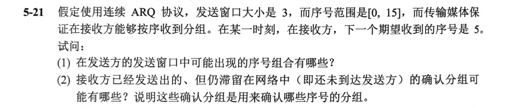

- > **解 :**

#### **[题5-37]**

- **题设 :**

  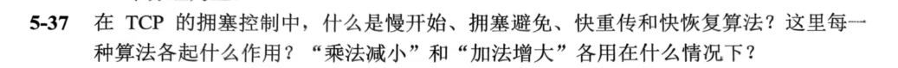

- > **解 :**

#### **[题5-38]**

- **题设 :**

  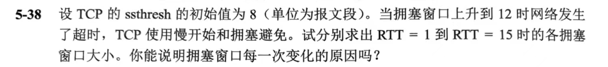

- > **解 :**

#### **[题5-39]**

- **题设 :**

  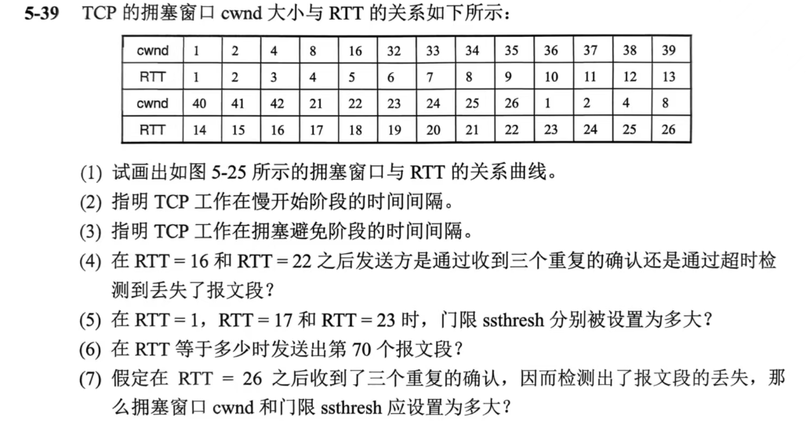

- > **解 :**
